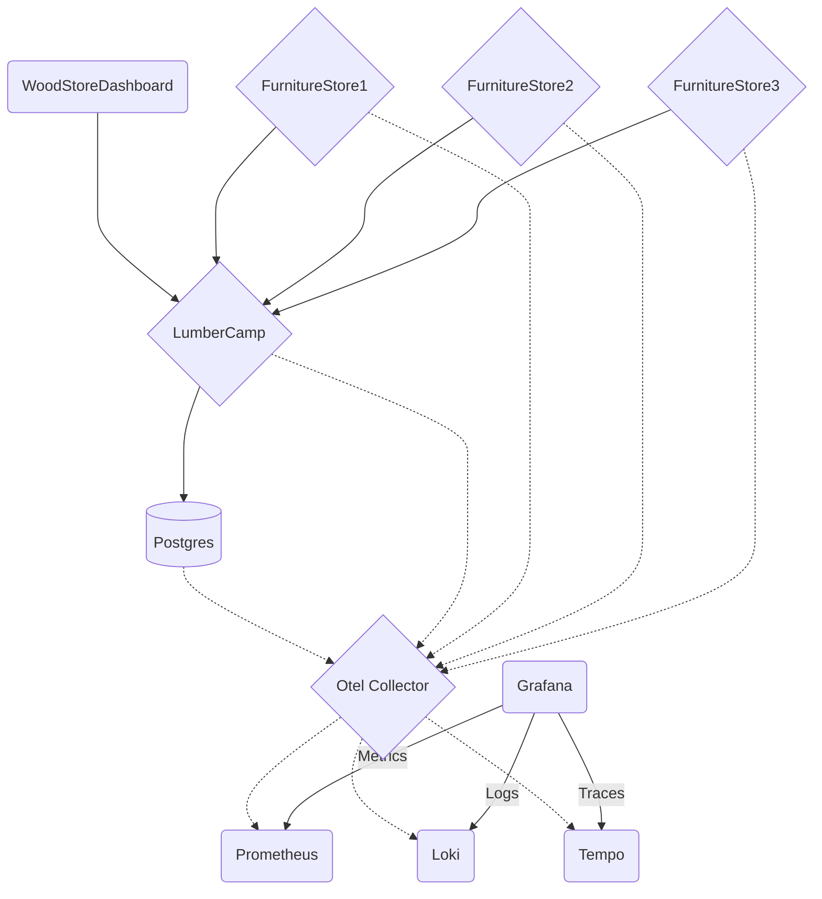

# 🪵 Un dashboard Grafana qui claque 🌟

Bienvenue dans ce workshop sur Grafana ! L'objectif est de vous faire découvrir et manipuler Grafana en exploitant différents types de données.

Pour cela, nous allons instancier Grafana et au fur et à mesure, nous ajouterons des sources de données et des dashboards, en explorant les différentes fonctionnalités.

Vous avez à votre disposition une application contenant un front, plusieurs backends et une base de données Postgres.

## Composants de l'application

- **Wood Store Dashboard** : Le front de l'application qui affiche les stocks
- **Furniture Store** : Plusieurs backends permettant de modifier les stocks de manière autonome
- **Lumber Camp** : Une API pour modifier les stocks et les commandes dans l'application
- **Postgres** : La base de données

## Composants de la stack d'observabilité

- **Otel Collector** : L'API permettant d'envoyer nos métriques, logs et traces
- **Prometheus** : La base de données pour les métriques
- **Loki** : La base de données pour les logs
- **Tempo** : La base de données pour les traces
- **Grafana** : L'outil de visualisation pour voir les métriques, logs et traces

## C'est parti 🍝

🛫 Let's go ! Première étape : Setup de l'environnement [➡️](setup/README.md)
