# Dashboard Business

On va maintenant changer de Datasource pour aller taper directement dans une base de données.

## Data Source

On va créer une nouvelle datasource via le menu `Connections > Data sources` et choisir `PostgreSQL` comme type de datasource.

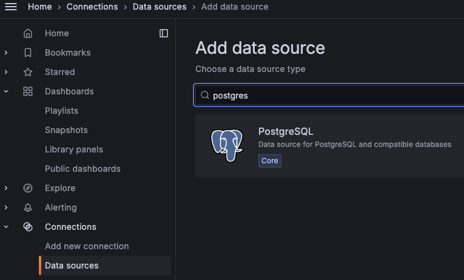{width="400"}

Les informations de connexion sont les suivantes :

| Information     | Value       |
|-----------------|-------------|
| URL             | postgres:5432 |
| Database        | jack        |
| User            | jack        |
| Password        | secret      |
| TLS/SSL Mode    | disable     |

!!! warning "Attention à tes doigts"
    Grafana ne fait aucun contrôle sur les requêtes qui sont envoyées sur la BDD. Un `DROP SCHEMA default CASCADE;` est assez efficace pour devoir réinitialiser la BDD...

    Une bonne pratique est donc d'avoir un compte en *read-only* pour Grafana pour accéder à la BDD.

!!!success
    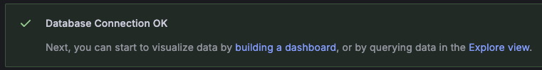

On peut maintenant commencer à construire notre dashboard (par exemple en cliquant sur *building a dashboard*).

## Lumbercamp front end

Nous avons actuellement une application qui permet de visualiser les données de notre application. C'est [woodstoredashboard](http://localhost:4200/helloWorld).

{width="450"}

Cette application stocke les données dans une base de données PostgreSQL. Les deux objets principaux sont les commandes dans la table *wood_order* et les stocks *stock*.

On va cette fois-ci faire un dashboard en utilisant cette source de données PostgreSQL. On va afficher les commandes.

## Données statiques

Il est possible d'afficher des informations qui ne sont pas temporelles dans un dashboard, en utilisant par exemple le mode de visualisation *Table*.

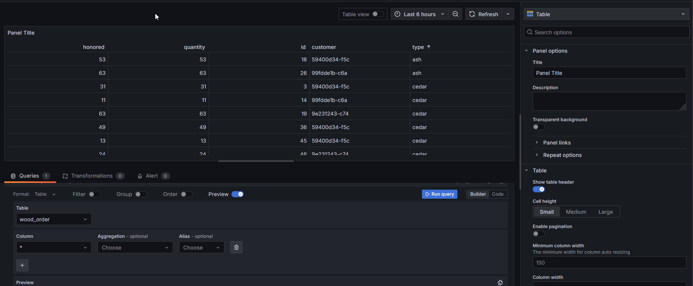

ℹ️ Il n'est alors pas possible de sélectionner une plage de temps. Ou plutôt ça ne sert à rien vu que l'information n'existe pas dans les données.

!!!success
    Ajouter 2 visualisations dans le dashboard pour afficher le contenu des 2 tables de la BDD

    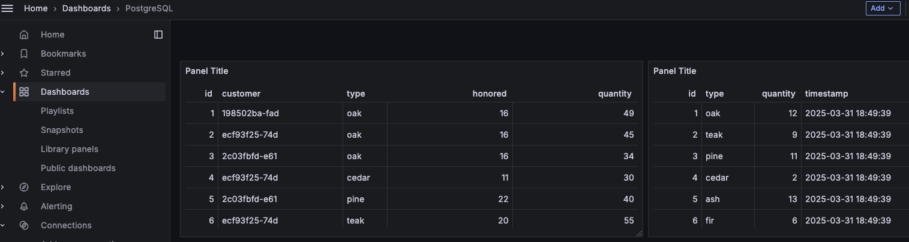

## Le dashboard cible

Dans ce TP, l'objectif est d'avoir un dashboard qui affiche:

* L'état des stocks
* Les commandes
* Un autre truc ?

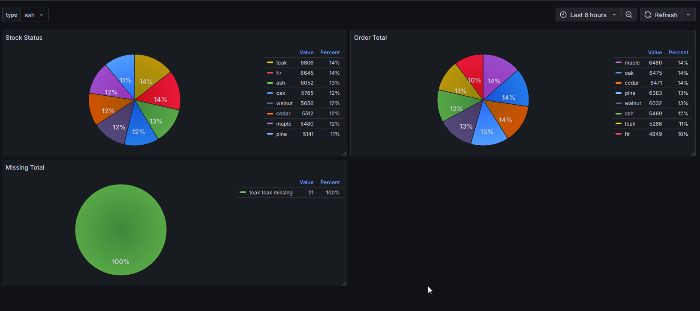{width="650"}

Nous allons utiliser le critère *essence de bois* dans tous nos widgets. Ce serait une bonne idée de créer une variable *type* pour pouvoir filtrer sur cette colonne.

Petit tips sur les [Query variable](https://grafana.com/docs/grafana/latest/datasources/postgres/query-editor/#query-variable){target="_blank"}

## Stock Status

On souhaite afficher la liste des essences de bois dans le stock.

Pour cela on va :

* créer un widget de type *Pie Chart*. 
* configurer la requête SQL pour faire la somme des quantités de bois par essence depuis la table *Stock*
* modifier les options pour avoir les pourcentages et les différents types affichés

???tip "Si la visualisation est en erreur"
    Il y a plus de détails sur l'icône warning:

    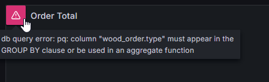

???danger "Spoiler la solution est là"

    * ```sql
    SELECT SUM(quantity) as quantity, type as type FROM stock GROUP BY type LIMIT 50 
    ```
    * On sélectionnera
        * les values pour ne pas être en `Calculate` mais en `All values`
        * la légende pour être sous la forme d'une table.
        * Les labels *Percent* et/ou *Value* 

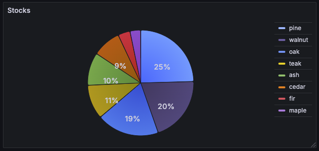{width="500}

## Order Total

On va faire la même chose pour les commandes. On va afficher le total des commandes par essence de bois, cette fois-ci avec le pourcentage affiché dans la légende et la valeur affichée sur le graphique.

Le formulaire c'est bien mais les vrais pros utilisent le mode *Code* 

En plus, il y a une fonction d'auto-complétion bien pratique pour les requêtes SQL.

???danger "Spoiler la solution est là"

    * ```sql
    SELECT sum(quantity), type FROM wood_order w GROUP BY type
    ```
    * On sélectionnera
        * les values pour ne pas être en `Calculate` mais en `All values`
        * la légende pour être sous la forme d'une table.
        * Les labels *Percent* et/ou *Value* 

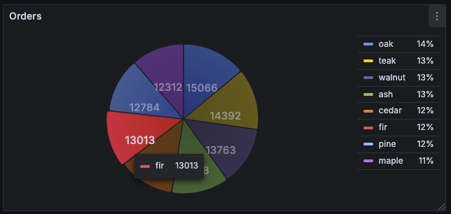{width="500}

## Et si on utilisait la colonne Timestamp

Vous avez peut-être remarqué que la table *wood_order* contient une colonne *timestamp*. 

On va créer un nouveau widget pour avoir une vision de nos commandes à travers le temps.

Lors de l'utilisation de l'auto-complétion, vous devez voir la proposition de fonctions :


Plusieurs [macro](https://grafana.com/docs/grafana/latest/datasources/postgres/query-editor/#macros){target="_blank"} sont mises à disposition pour faciliter l'utilisation des dates.

Même si nos données ne sont pas au format time series mais que nous avons une information sur le temps, il est possible de faire des graphiques temporels.

Il faut un peu aider Grafana en lui indiquant que la colonne est un timestamp.

Et rajouter une clause where pour prendre en compte la plage de temps ou utiliser un [filtre](https://grafana.com/docs/grafana/latest/datasources/postgres/query-editor/#query-variable){target="_blank"}.

!!!success
    * Créer un widget de type *Histogramme* qui montre le nombre de commandes par type d'essence d'arbre
    * Configurer des *thresholds* à 25%, 50% et 75%

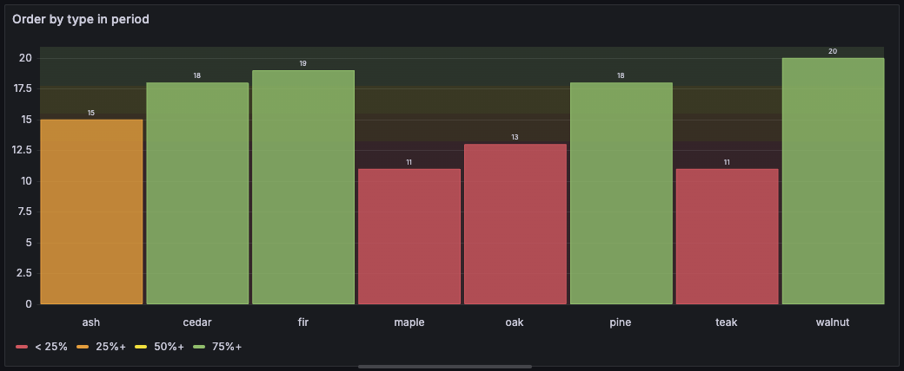

???danger "Spoiler la solution est là"
    * ```sql
    SELECT count(id), type FROM wood_order WHERE $__timeFilter(timestamp) GROUP BY type
    ```
    * `Standard options > Color scheme` : `From thresholds (by value)``
    * Ajouter 3 thresholds

On peut maintenant afficher des données sous la forme d'un histogramme et voir l'évolution des commandes / stock dans le temps en changeant la plage de temps d'affichage.

## Encore plus fort : les *Transformations*

Afin de manipuler les transformations, nous voulons maintenant afficher les quantités qui n'ont pas pu être honorées dans les commandes par type d'essence.

Mais nous n'avons pas directement cette information dans la table *wood_order*. On a un champ quantité commandée (*quantity*) et un champ quantité livrée (*honored*).

On pourrait se passer des *transformations* avec une bonne grosse requête SQL et des jointures mais ce n'est pas pédagogique ! 😉

L'objectif est donc de:

* Afficher pour chaque type d'essence une *Gauge* montrant le pourcentage de quantité non-livrée
* Utiliser max. 2 requêtes SQL
* Utiliser uniquement des transformations pour construire la donnée

???question "Besoin d'un coup de pouce ?"
    On va faire ici 2 requêtes, l'une pour récupérer la quantité effectivement livrée "honored", l'autre pour récupérer la quantité commandée "quantity".

    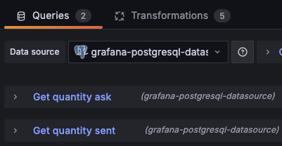
    ```sql
    SELECT type, SUM(quantity) AS "ask" FROM wood_order WHERE $__timeFilter("timestamp") GROUP BY type LIMIT 50
    ```
    ```sql
    SELECT type, SUM(honored) AS "sent" FROM wood_order WHERE $__timeFilter("timestamp")  GROUP BY type LIMIT 50 
    ```
???question "Un autre ?!"
    La première transformation consiste à "ignorer" les 2 frames pour ne faire qu'un jeu de données
    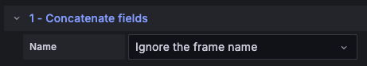

!!!success
    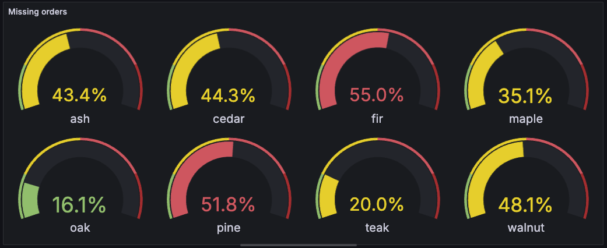

???danger "Spoiler la solution est là"
    1. Il faut faire 2 requêtes SQL pour récupérer les quantités commandées et livrées par commande
        ```sql
        SELECT type, SUM(quantity) AS "ask" FROM wood_order WHERE $__timeFilter("timestamp") GROUP BY type LIMIT 50
        ```
        ```sql
        SELECT type, SUM(honored) AS "sent" FROM wood_order WHERE $__timeFilter("timestamp")  GROUP BY type LIMIT 50 
        ```
    2. Ajouter une première transformation pour utiliser les données des 2 requêtes comme une seule donnée
    
    3. Ajouter une transformation pour calculer le delta entre ce qui a été commandé et ce qui a été livré
    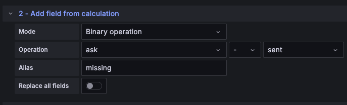
    4. Ajouter une transformation pour filtrer les résultats strictement positifs
    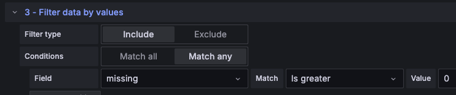
    5. Ajouter une transformation pour calculer le pourcentage de ce qui est manquant par rapport au total
    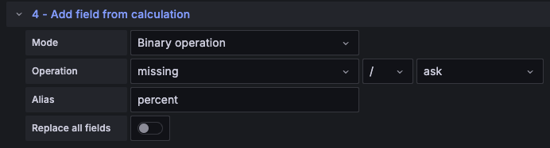
    6. Ajouter une transformation pour filtrer les données qui nous intéressent : le *type* et le *pourcentage calculé*
    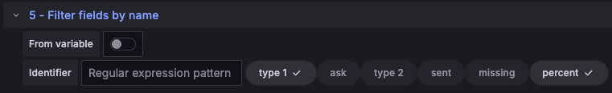
    7. Configurer le widget en type *Gauge* en affichant toutes les valeurs (*All values*) des champs numériques (*Numeric Fields*), avec une unité en *Percent (0.0-1.0) et des thresholds à `0.2`, `0.5`, `0.8`
    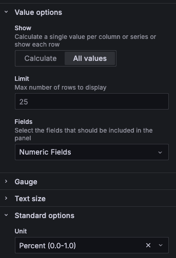

## Et pour cloturer : les *Variables*

Il serait intéressant de pouvoir filtrer tous les widgets d'un dashboard en fonction du type d'essence d'arbre par exemple pour avoir les infos filtrées uniquement sur l'essence souhaitée.

Dans cette dernière étape du lab, on va donc ajouter une *Variable* au niveau du Dashboard pour pouvoir filtrer en fonction de l'essence que l'on souhaite

### Configurer la variable

Dans les *Settings* du dashboard, configurer une variable `type_of_wood` qui récupère la liste des essences.

!!!success
    Une fois configuré, un champ de filtrage après sur le dashboard listant les différentes essences trouvées ET l'option `All`

    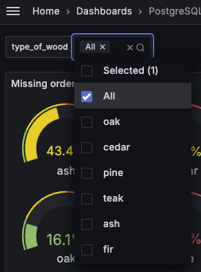{width="200"}

???danger "Spoiler la solution est là"
    Il faut configurer la variable pour utiliser la datasource Postgre et la requête suivante pour récupérer la liste des essences.
    ```sql
    select type from wood_order
    ```
    Et ne pas oublier de cocher les 2 options :
    
    * `Multi-value`
    * `Include All option`

### Modifer les widgets

Maintenant que notre variable est disponible, il faut modifier les widgets pour qu'ils la prennent en compte.

Modifier donc les 4 widgets pour que l'on puisse filtrer sur le type d'essence au niveau du dashboard et que dans leur titre les essences choisies soient afficher

!!!success
    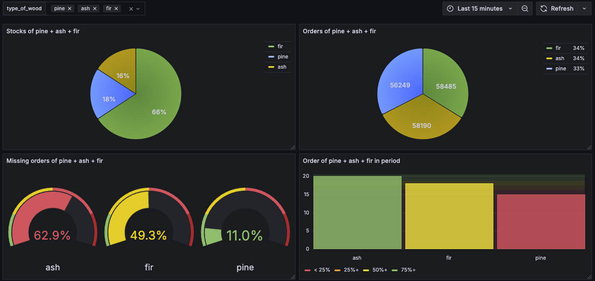

???danger "Spoiler la solution est là"
    Il suffit de:

    * Modifier les requêtes SQL des widget pour inclure une clause `WHERE`:
    ```sql
    SELECT SUM(quantity) AS "quantity", type AS "type" FROM stock s WHERE s.type IN ( $type_of_wood ) GROUP BY type LIMIT 50
    ```

    * Modifier le `Title` du panel pour inclure la variable `type_of_wood``
    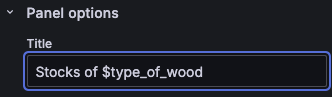
