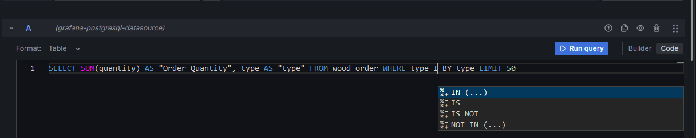
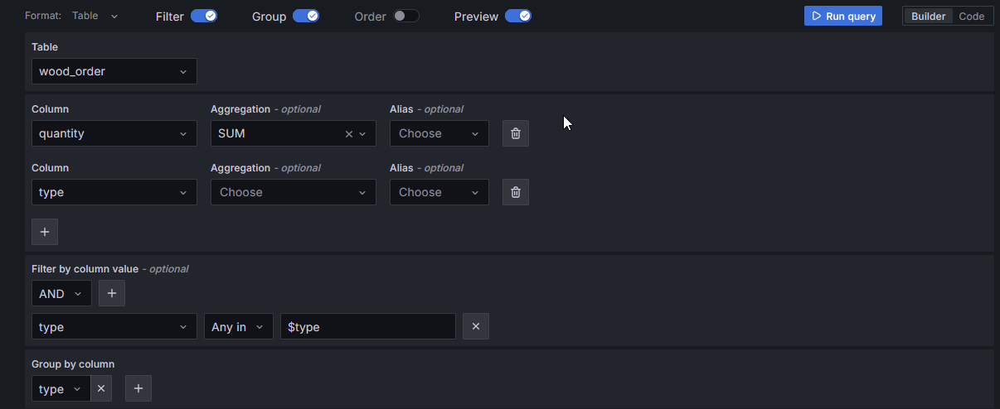
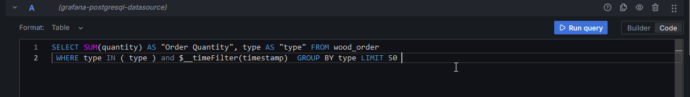
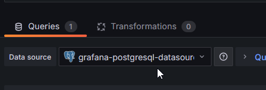
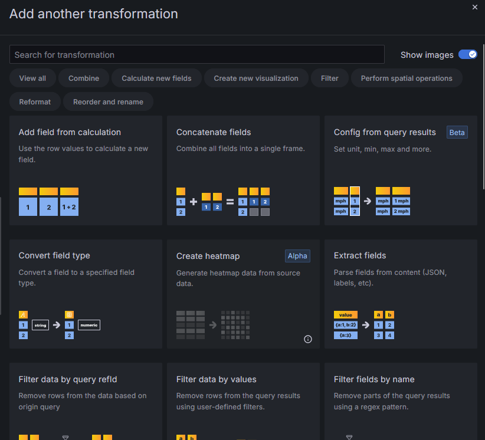
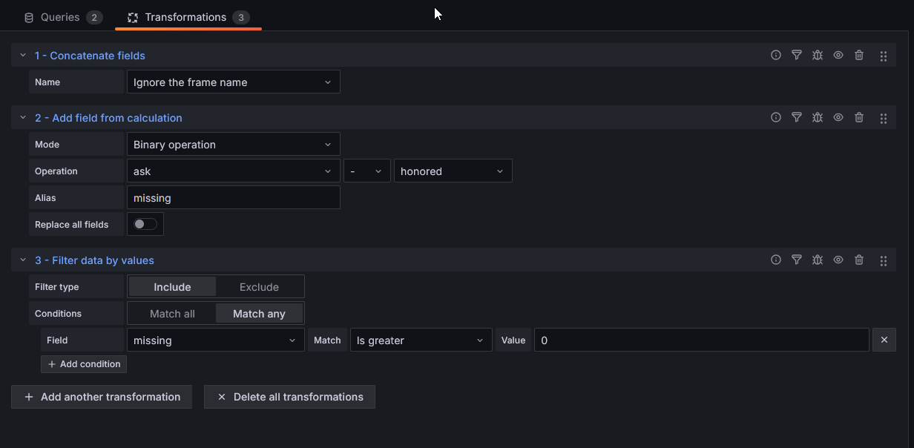

# Dashboard Business

On va maintenant changer de Datasource pour aller taper directement dans la base de données de notre application.

## Data Source

On va refaire la même chose que pour le datasource précédent, mais cette fois-ci on va choisir `PostgreSQL` comme type de datasource.

Les informations de connexion sont les suivantes :

* URL: postgres:5432
* Database: jack
* User: jack
* Password: secret

## Lumbercamp front end

Nous avons actuellement une application qui permet de visualiser les données de notre application. C'est [woodstoredashboard](http://localhost:4200/helloWorld).


Cette application stocke les données dans une base de données PostgreSQL. Les deux objets principaux sont les commandes dans la table *wood_order* et les stocks *stock*.

On va cette fois-ci faire un dashboard en utilisant cette source de données PostgreSQL. On va afficher les commandes.

Cette fois-ci exit le PromQL et on utilisera des requêtes SQL.

!!! warning attention à tes doigts

    L'utilisateur utilisé pour se connecter à la base de données est l'utilisateur applicatif.
    Comme indiqué lors de la création de la base de données c'est *UNE TRÈS MAUVAISE PRATIQUE*.
    En effet Grafana ne fait aucun contrôle sur les requêtes qui sont envoyées sur la BDD. Un `DROP SCHEMA default CASCADE;` est assez efficace pour devoir réinitialiser la BDD. 

## Données non temporelles


Il est possible d'afficher des informations qui ne sont pas temporelles dans un dashboard.

Il n'est alors pas possible de sélectionner une plage de temps. Ou plutôt ça ne sert à rien vu que l'information n'existe pas dans les données.

## Le dashboard cible


Nous allons utiliser le critère *essence de bois* dans tous nos widgets. Ce serait une bonne idée de créer une variable *type* pour pouvoir filtrer sur cette colonne.

Petit tips sur les [Query variable](https://grafana.com/docs/grafana/latest/datasources/postgres/#query-variable)

## Stock Status

On souhaite afficher la liste des essences de bois dans le stock.

Pour cela on va utiliser un widget de type *Pie Chart*. Il faut configurer la requête SQL pour faire la somme des quantités de bois par essence depuis la table *Stock*

Si la visualisation est en erreur il y a plus de détails sur l'icône warning :


??? Example "Spoiler la solution est là"

    ```sql
    SELECT SUM(quantity) as quantity, type as type FROM stock GROUP BY type LIMIT 50 
    ```
    On sélectionnera la légende pour être sous la forme d'une table.

    Les labels *Percent* et *Value* 

    les Fields *quantity*

## Order Total

On va faire la même chose pour les commandes. On va afficher le total des commandes par essence de bois.

Le formulaire c'est bien mais les vrais pros utilisent le mode *Code*.

Il y a une fonction d'auto-complétion bien pratique pour les requêtes SQL.


??? Example "Spoiler la solution est là"
    

## Et si on avait une colonne Timestamp

Vous avez peut-être remarqué que la table *wood_order* contient une colonne *timestamp*.
Et lors de l'utilisation de l'auto-complétion peut-être avez-vous vu :


Plusieurs [macro](https://grafana.com/docs/grafana/latest/datasources/postgres/#macros) sont mises à disposition pour faciliter l'utilisation des dates.

Même si nos données ne sont pas au format time series mais que nous avons une information sur le temps, il est possible de faire des graphiques temporels.

Il faut un peu aider Grafana en lui indiquant que la colonne est un timestamp.

Et rajouter une clause where pour prendre en compte la plage de temps. Ou utiliser un [filtre](https://grafana.com/docs/grafana/latest/datasources/postgres/#filter-data-where).

??? Example "Spoiler la solution est là"
    

On peut maintenant afficher des données sous la forme d'un histogramme et voir l'évolution des commandes / stock dans le temps.

### Encore plus fort : Transformations

Nous voulons maintenant afficher les quantités qui n'ont pas pu être honorées dans les commandes.

Mais nous n'avons pas directement cette information dans la table *wood_order*. On a un champ quantité commandée et un champ quantité livrée (*honored*).

Il est possible de faire des [transformations](https://grafana.com/docs/grafana/latest/panels-visualizations/query-transform-data/transform-data/) sur les données quelle que soit la source de données. Ces opérations seront réalisées par Grafana et ne solliciteront pas les SGBD pour les calculs.

À côté de l'onglet *Query* il y a l'onglet *Transformations* qui permet de faire des opérations sur les données.



Alors c'est possible de se passer des *transformations* avec une bonne grosse requête SQL mais ce n'est pas pédagogique ! Alors au travail, bien entendu on veut conserver notre filtre principal sur le type de bois.

??? Question "Besoin d'un coup de pouce ?"
    On va faire ici 2 requêtes, l'une pour récupérer la quantité effectivement livrée "honored", l'autre pour récupérer la quantité commandée "quantity".

    Puis on va concaténer les deux réponses, ajouter un champ calculé *missing* et enfin filtrer pour n'afficher que les types qui ont une quantité manquante positive et supérieure à 0.

??? Example "Spoiler la solution est là"
    
