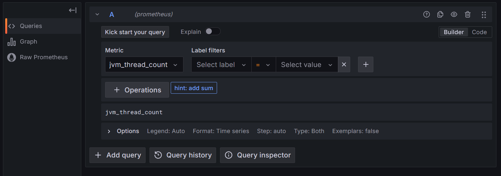
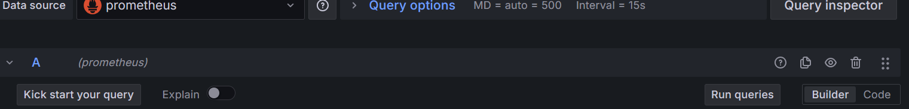
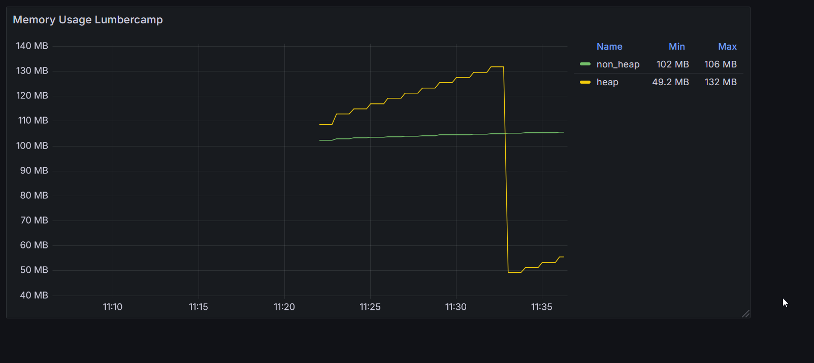
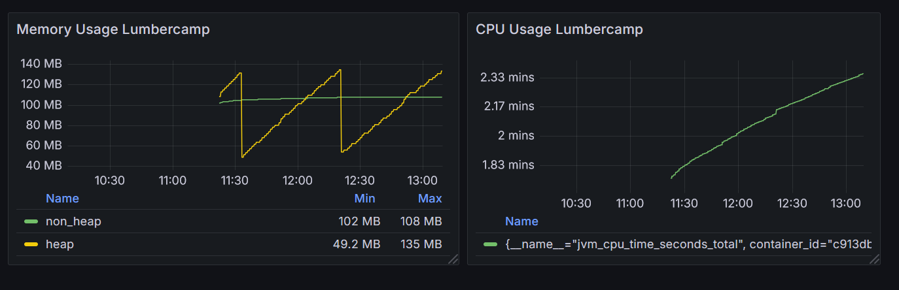
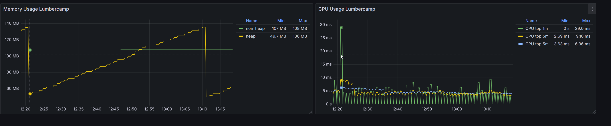

# Metrics Dashboard

Pour accessibles les données, il faut les importer dans Grafana. Pour cela, il faut ajouter une source de données.

Rendez-vous dans le menu de configuration à gauche, puis cliquez sur *Connections*.

## Configuration

### Les différents types de data sources

Il existe de mulitples plugin pour se connecter à différentes data sources.

On retrouve bien évidement les datasources sur des basses de donénes de type time series (prometheus, tempo, influxDB). Mais aussi des bases relationelles ou NoSQL, des bases de traces (Jaeger, Tempo) ou de log (Loki, Elastisearch).

Chaque sources de données à sa propre configuration et son propre language de requetage.

#### Prometheus

Nous allons ajouter une *DS* Prometheus pour afficher les métriques de nos applications Java.

L'URL est `http://prometheus:9090`.  Vous pouvez d'ailleur vous connecter à cette instance qui tourne en local [ici](http://localhost:9090).

Comme tout est en local nous n'avons pas d'autentification à ajouter. Ni de gestion des TLS.

Nommez votre *DS* `prometheus` et cliquez sur *Save & Test*.

### La fonction explore

La fonction *Explore* permet de tester les requetes directement sans passer par un dashboard.

On retrouve le meme type de formulaire que pour les query d'un widget.

Une visualisation par defaut est proposée pour afficher les données.

Et les données brutes.

Cet affichage est aussi accessible sur un widget dans l'écran de configurations des Query.

!!! info "Formulaire query"

    Dans les versions récentes de Grafana on retrouve un mode *Builder* qui permet de construire la requete à l'aide d'un formulaire.
    
    On est guidé dans la construction de la requete. Le formulaire s'adapte à chaque type de requete (PromQL, SQL ...).
    C'est souvent pratique pour débuter et pour debuger une requete.

    Le mode Code permet de voir la requete. C'est souvent plus rapide pour modifier une requete.

### Quelques mots sur PromQL

Prometheus utilise le language [PromQL](https://prometheus.io/docs/prometheus/latest/querying/basics/) pour Prometheus Query Language ...

Une requete *PromQL* retourne une liste d'enregistrement, ils sont composé des éléments suivant :

* le nom de la metric
* les labeles associés à la metric
* la valeur de la metric
* le timestamp

La clef primaire d'un enregistrement est la combinaison du nom de la metric et les labels associés.

Les labels et le nom de la metric sont en partie définit par la source donnée. Il est aussi possible d'ajouter des regles dans prometheus pour ajouter / modifier / supprimer des labels.

Par default Prometheus vas ajouter des labels pour donner des informations sur la source des données (le label **job** par exemple).

 C'est tres utile pour séparer les données de plusieurs sources (ex environnement de production / preprod).

## Le dashboard

Maintenant on vas créer un nouveau Dashboard nommé *Dashboard de monitoring*.

On ajouter une *Visualization* et on selection la *DS* précédement créee.

### Mémoire

On souhaite afficher un graph des métriques de mémoire de notre application Java.

Pour cela, on va utiliser la metric suivante : *jvm_memory_used_bytes*

En spécifiant uniquement le nom de la metric on remonte l'ensemble des valeurs associée à cette metric.

Prometheus utilise des *Labels* pour donner plus d'information sur une metric.

#### Configuration du widget

Pour le moment notre widget n'est pas particulierement lisible. On va ajouter des informations pour le rendre plus lisible.

Toutes les informations mémoire de nos JVM sont retourné sur le meme graphe.

On vas selectionner uniquement celles du service *lumbercamp*. Observer les labels pour identifier ceux qui sont le plus interessant. et modifier la requete en conséquence.

Soit à l'aide du builder de requete, soit en modifiant directement la requete avec l'onglet code :

Changez les unités du graph pour afficher les valeurs en MB.

On souhaite afficher les mémoires [Heap / Non Heap](https://medium.com/@kiarash.shamaii/understanding-javas-memory-model-and-the-inner-workings-of-garbage-collection-f73e2b399605) pour le service *lumbercamp* pour suivre l'evolution de la mémoire.

!!! tip "Changez la query pour avoir le paramétrage suivant"

    Le label `jvm_memory_type` permet de faire la différence entre la Heap et la non Heap.

    Attention `jvm_memory_pool_name="Metaspace"` est déjà la somme des pool : "CodeHeap 'non-nmethods'" "CodeHeap 'non-profiled nmethods'" "CodeHeap 'profiled nmethods'" "Compressed Class Space"

#### PromQL Sum

le language de requetage *PromQL* permet de faire des opérations sur les données. On utilisera ici l'opérateur d'aggregation [sum](https://prometheus.io/docs/prometheus/latest/querying/operators/#aggregation-operators)

L'objectif et d'avoir le dashboard suivant : 

On affichera la mémoire Heap avec une query et la non heap avec un autre sur le meme graph.

Le fait de pouvoir ajouter de multiple query sur un meme graph permet d'afficher des données avec des modes de calcul différents.

On peux facilement dupliquer une query pour la modifier et l'adapter à nos besoins.

### CPU

On va aussi afficher la consomation CPU de nos applications.

Pour cela on va utiliser la metric `jvm_cpu_time_seconds_total`.

#### Les metrics total

Petit probleme ici, la valeur correspond à la somme des temps CPU utilisé par l'ensemble des threads de notre application depuis le démarrage.

#### PromQL Rate

On aimerais avoir la consomation par minutes. Pour celà il existe des [fonctions](https://prometheus.io/docs/prometheus/latest/querying/functions/) avec **PromQL** notamment [rate](https://prometheus.io/docs/prometheus/latest/querying/functions/#rate) qui permet de calculer la dérivée d'une série temporelle.

Cette fonction travaille avec un **range-vector**. Le range-vector est un vecteur de valeurs sur une période donnée. Ainsi pour calculer la dérivée d'une série temporelle, il faut spécifier une période.

On utilisera les ranges **[1m]** **[5m]** **[15m]** qui vas calculer un rate par seconde en se basant sur l'ensemble des données des *X* dernières minutes pour chaque point de données. On reproduit ainsi l'affichage du `top` unix.

L'objectif et d'obtenir le graph suivant :

Ok c'est pas mal mais allons plus loin :

**🛫 Prochaine étape : Dashboard Metrics Step2 [➡️](../dashboard-metrics/advanced.md)**
