# Metrics Dashboard

## Configuration

### Prometheus

Nous allons ajouter une *DataSource* `Prometheus` pour afficher les métriques issues d'applications Java.

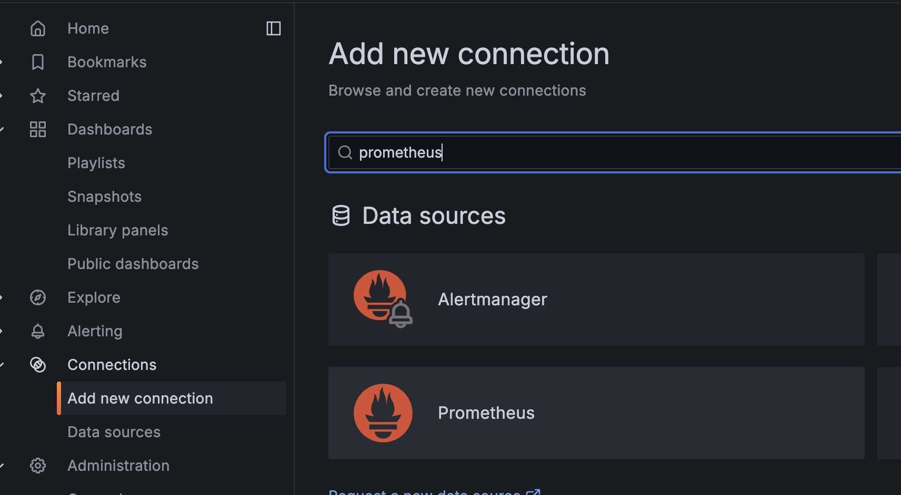{width="350"}

| Information     | Value       |
|-----------------|-------------|
| Name            | prometheus  |
| URL             | http://prometheus:9090 |
| Authentication methods | No Authentication |
| Skip TLS certificate validation    | true     |

😇 Comme tout est en local, nous n'avons pas d'authentification à ajouter. Ni de gestion des TLS.

Vous pouvez d'ailleurs vous connecter à cette instance qui tourne en local [ici](http://localhost:9090){target="_blank"}

!!!success
    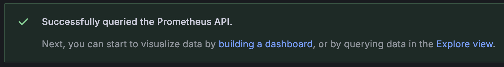

### La fonction explore

Avant de créer notre dashboard, on peut facilement explorer les données disponibles via cette *DataSource* en cliquant sur le bouton `Explore data` en haut à droite qui redirige vers le menu `Explore`. On retrouve le même type de formulaire que pour les requêtes d'un widget.

On peut facilement voir les métriques disponibles via le `metrics browser`

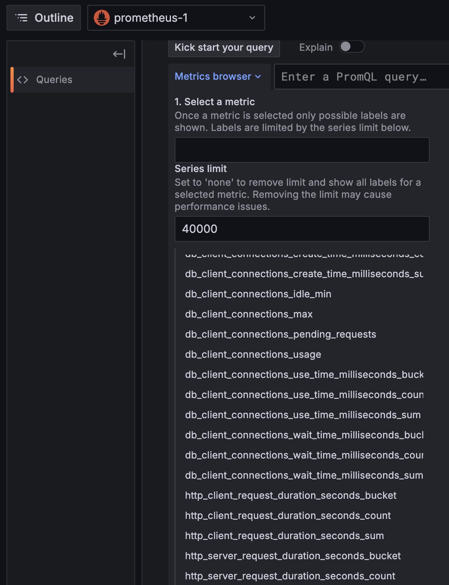{width="300"}

Mais aussi grâce à l'auto-complétion:

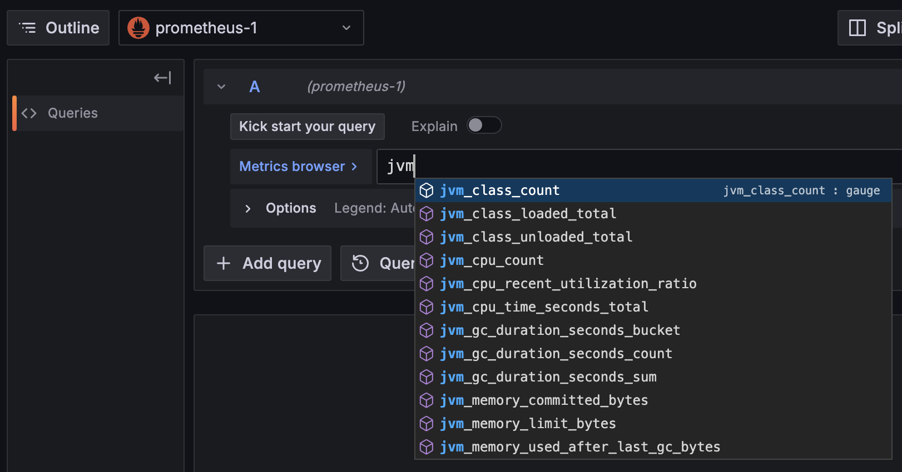

Une visualisation par défaut est proposée pour afficher les données:


Et les données brutes:

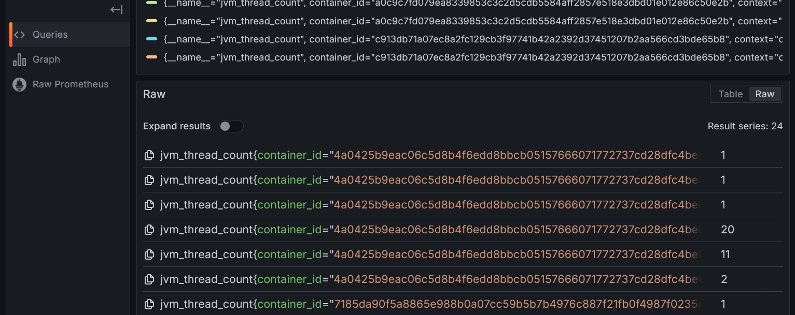

### Quelques mots sur PromQL

Prometheus utilise le langage [PromQL](https://prometheus.io/docs/prometheus/latest/querying/basics/){target="_blank"} pour `Prometheus Query Language` ...

Une requête *PromQL* retourne une liste d'enregistrements, ils sont composés des éléments suivants :

* Name: le nom de la métrique
* Labels: les labels associés à la métrique
* Sample: la valeur de la métrique
* Timestamp: le timestamp

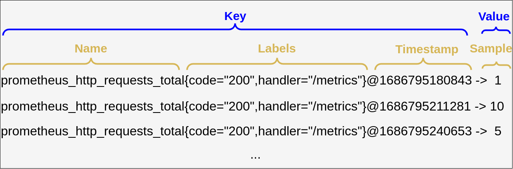
Ce schema est extrait de l'article [introduction to prometheus promql](https://levelup.gitconnected.com/introduction-to-prometheus-promql-local-setup-included-28f1da9cc2f8)

La clé d'un enregistrement est la combinaison du nom de la métrique, des labels associés et du temps.

```prometeheus
http_requests_total{app="myApp",instance="blue"}@1600000000 -> 5
http_requests_total{app="myApp",instance="green"}@1600000000 -> 10
```

Dans l'exemple ci-dessus, on a deux enregistrements pour la même métrique `http_requests_total` mais avec des labels différents.

On peut donc avoir plusieurs valeurs pour la même métrique :

* Le **Quoi** : Ici **http_requests_total** qui exprime une unité : on observer un nombre de requete total.
* Le **Qui** : Toutes les deux concernent l'aplication `myApp` mais sur deux instances différentes (une `blue` et une `green`).
* Le **Quand** : La valeur est associée à un timestamp, ici `1600000000` (en secondes depuis le 1er janvier 1970).
* La **Valeur** : La valeur de la métrique, ici `5` et `10`.

Les labels et le nom de la métrique sont en partie définis par la source de données. Il est aussi possible d'ajouter des règles dans Prometheus pour [ajouter / modifier / supprimer des labels](https://prometheus.io/docs/prometheus/latest/configuration/configuration/#relabel_config).

Par défaut, Prometheus va ajouter des labels pour donner des informations sur la source des données (le label **job** par exemple).

C'est très utile pour séparer les données de plusieurs sources (ex environnement de production / préprod ou dans l'exemple précédent **blue** et **green**).

## Le dashboard

Démarrons maintenant le lab : créer un nouveau Dashboard nommé *Dashboard de monitoring*.

### Monitoring de la mémoire

Ajouter une nouvelle visualisation pour afficher les métriques de mémoire de notre application Java en choisissant la *DataSource* `prometheus` précédemment créée.

On va utiliser la métrique suivante : *jvm_memory_used_bytes* pour configurer la *Query*.

En spécifiant uniquement le nom de la métrique, on remonte l'ensemble des valeurs associées à cette métrique.

!!!success "Les métriques sont bien affichées"
    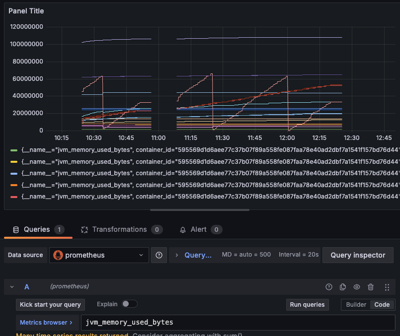

Prometheus utilise des *Labels* pour donner plus d'informations sur une métrique

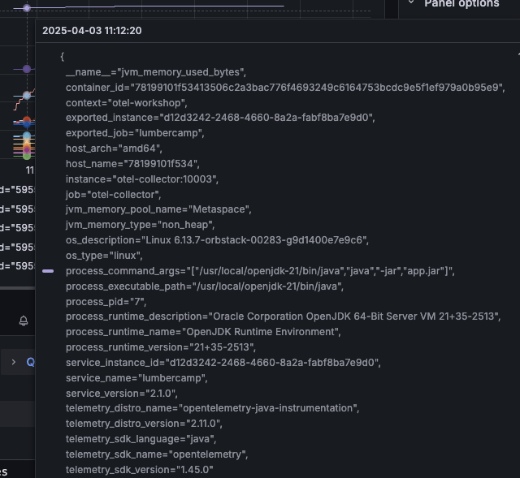

#### Configuration du widget

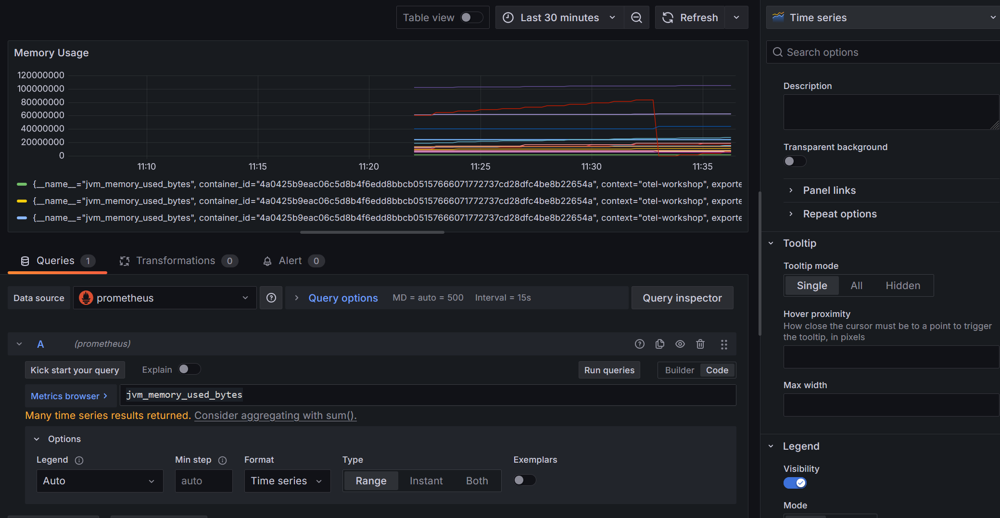

Pour le moment, notre widget n'est pas particulièrement lisible (Toutes les informations mémoire de nos JVM sont retournées sur le même graphe). On va ajouter des informations pour le rendre plus lisible.

On souhaite afficher les mémoires [Heap / Non Heap](https://medium.com/@kiarash.shamaii/understanding-javas-memory-model-and-the-inner-workings-of-garbage-collection-f73e2b399605){target="_blank"} pour le service *lumbercamp* pour suivre l'évolution de la mémoire.

En observant les labels pour identifier ceux qui sont les plus intéressants et modifier le widget en conséquence:

* Filtrer pour n'afficher que les infos en lien avec le service *lumbercamp*.
* Modifier les unités du graphe pour que les valeurs soient en `bytes`
* Afficher **uniquement 2** courbes représentant la mémoire de type *heap* et la mémoire de type *non_heap*

Le langage de requêtage *PromQL* permet de faire des opérations sur les données. On utilisera ici l'opérateur d'agrégation [sum](https://prometheus.io/docs/prometheus/latest/querying/operators/#aggregation-operators){target="_blank"}

???tip "Un indice"
    Le label `jvm_memory_type` permet de faire la différence entre la **heap** et la **non_heap**.
    Il y a plusieurs metrics pour chaque sous catégories de mémoire. Par exemple, pour la **heap**, on a un label (`jvm_memory_pool_name` )qui permet de faire la différence entre ces sous catégories.

???tip "Indice 2"
    Attention `jvm_memory_pool_name="Metaspace"` est déjà la somme des pools : "CodeHeap 'non-nmethods'" "CodeHeap 'non-profiled nmethods'" "CodeHeap 'profiled nmethods'" "Compressed Class Space"...

!!!success
    

???danger "Spoiler la solution est là"
    Il faut faire 2 *Query* :

    * Une pour la partie **heap** en sommant toutes les infos en lien avec un `jvm_memory_type` = `heap`
    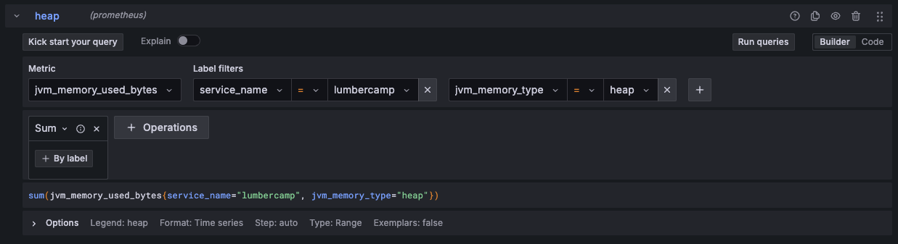

    * Une pour la partie **non_heap** en filtrant uniquement sur le `jvm_memory_pool_name` = `Metaspace` du fait qu'il représente déjà la somme des mémoires *non_heap*
    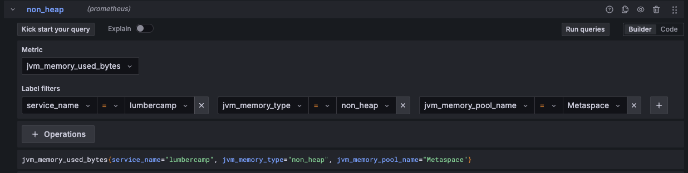

    * Le fait de pouvoir ajouter de multiples queries sur un même graphe permet d'afficher des données avec des modes de calcul différents.

### Monitoring du CPU

On va aussi afficher la consommation CPU de notre application *lumbercamp*.

Pour cela, on va utiliser la métrique `jvm_cpu_time_seconds_total`.

#### Les métriques de type `total`

Petit problème ici, la valeur correspond à la somme des temps CPU utilisés par l'ensemble des threads de notre application depuis le démarrage.

🛟 `PromQL Rate` à la rescousse

On aimerait avoir la consommation par minute. Pour cela, il existe des [fonctions](https://prometheus.io/docs/prometheus/latest/querying/functions/){target="_blank"} avec **PromQL** notamment [rate](https://prometheus.io/docs/prometheus/latest/querying/functions/#rate){target="_blank"} qui permet de calculer la dérivée d'une série temporelle.

Cette fonction travaille avec un **range-vector**. Le range-vector est un vecteur de valeurs sur une période donnée. Ainsi, pour calculer la dérivée d'une série temporelle, il faut spécifier une période.

???note "Pourquoi **rate** et pas **delta** ou **increase** ?"

    * La fonction **rate** est plus adaptée pour les séries temporelles car elle prend en compte les variations de la série dans le temps.Elle calcule la dérivée aux bornes du range indiqué.
    * La fonction **delta** ne fait que calculer la différence entre deux valeurs, sans tenir compte du temps écoulé entre elles. De plus elle ne prends pas en compte un reset de la série (par exemple si l'application redémarre, la valeur de la métrique est remise à zéro).
    * La fonction **increase** est utilisée pour calculer l'augmentation totale d'une série temporelle sur une période donnée. Elle ne calcule pas la dérivée, mais plutôt la somme des augmentations sur cette période.

On utilisera les ranges **[1m]** **[5m]** **[15m]** qui vont calculer un rate par seconde en se basant sur l'ensemble des données des *X* dernières minutes pour chaque point de données. On reproduit ainsi l'affichage du `top` unix.

???tip "Astuce"
    Vous pouvez facilement dupliquer une *Query* pour ne changer que l'intervalle souhaité

!!!success
    L'objectif est d'obtenir le graphe suivant avec 3 courbes pour les rates **[1m]**, **[5m]** et **[15m]**

    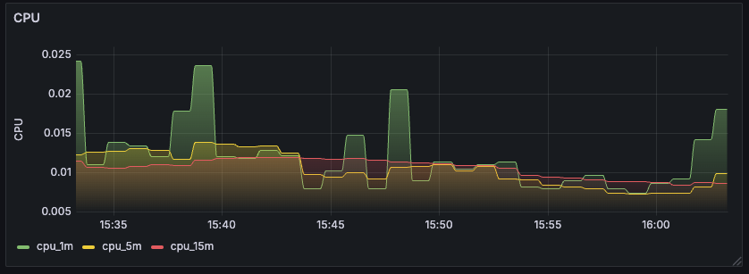

???danger "Spoiler la solution est là"
    Il faut faire 3 *Query* en changeant l'interval

    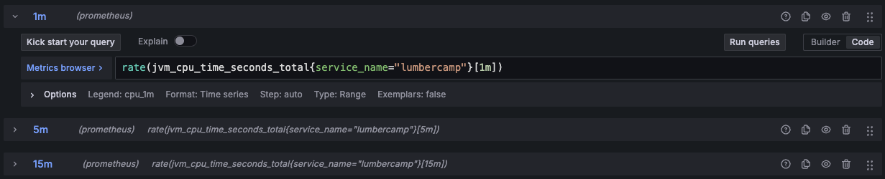

## Filtrage par service

Comme on l'a fait pour le dashboard Postgres, il serait pratique de pouvoir dynamiquement filtrer les informations affichées par les widgets.

Pour ce dashboard, on va donc ajouter une variable permettant de changer le nom du service pour lequel on souhaite avoir les métriques.

Objectifs:

* Créer une variable `prom_service_name` basée sur la *DataSource* `prometheus` permettant de récupérer les services monitorés par Prometheus
* Modifier les 2 widgets pour qu'il prenne en compte cette nouvelle variable dans leurs *Query* et dans leur titre

!!!success
    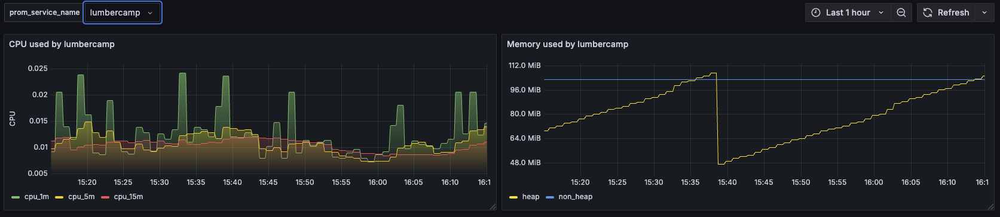

???danger "Spoiler la solution est là"
    * La configuration de la variable

    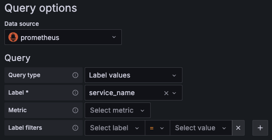

    * Un exemple de *Query* modifiée
    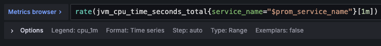

Ok c'est pas mal mais allons plus loin :

**🛫 Prochaine étape : Dashboard Advanced [➡️](../dashboard-metrics/advanced.md)**
