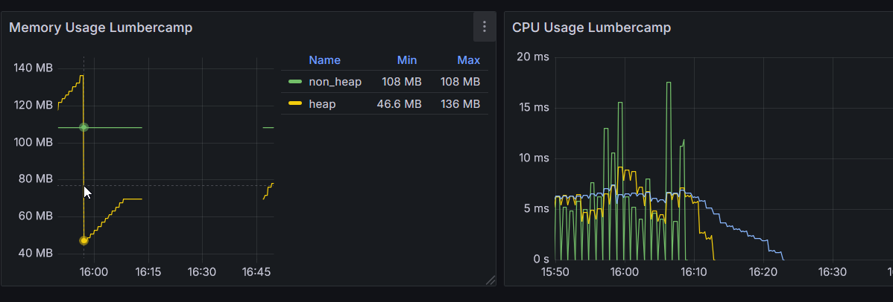
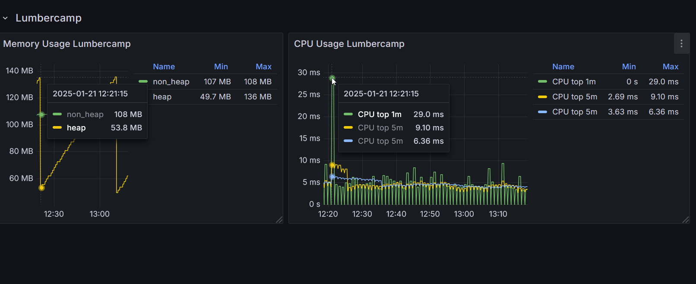
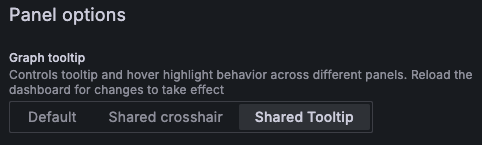
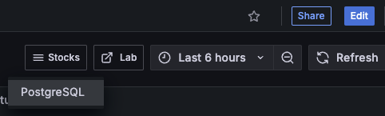
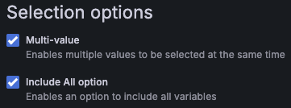
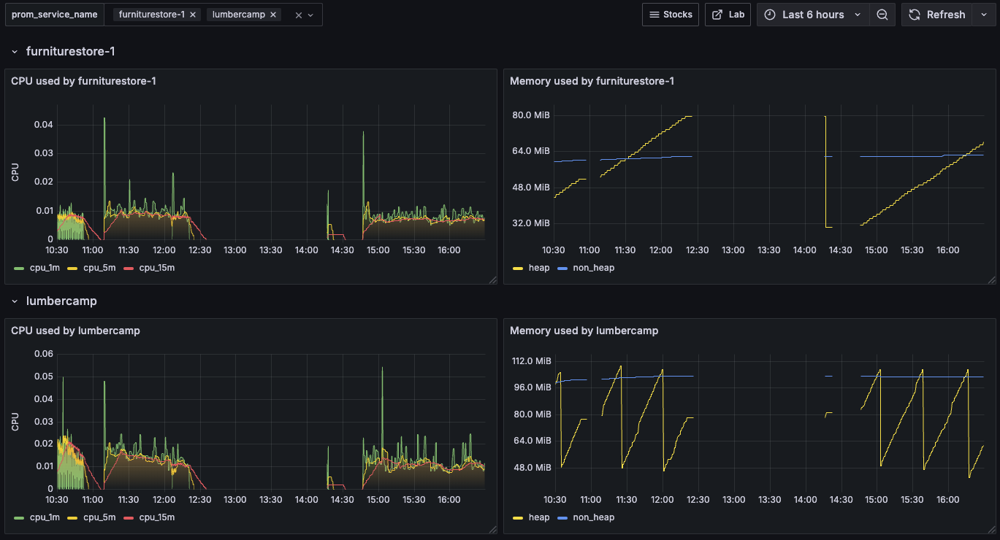
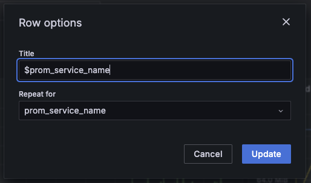

# Un dashboard un peu plus avancé

## Configuration du dashboard

!!!tip "Paramètres généraux du dashboard"

    On peut paramétrer des informations sur le dashboard (Lecture seule, tags, description ...)

    On peut aussi changer les fréquences de rafraîchissement du dashboard, voire masquer la possibilité de changer la plage de temps consultée.

### Tooltip

On aimerait voir s'il y a une corrélation entre la consommation CPU et la mémoire. Pour le moment, lors du survol d'un point du graph des CPU, on voit seulement les valeurs du TOP et pas de la mémoire.

L'idée est de pouvoir facilement faire des corrélations entre les widgets en configurant le Dashboard.

!!!success
    Quand on survole un widget, on a l'information qui s'affiche également sur les autres widgets
    

???danger "Spoiler la solution est là"
    Dans `Settings > General > Panel options`, activez l'option `Shared Tooltip``

    

Ici par exemple, on remarque que lorsque la mémoire baisse, le CPU augmente (avec un léger temps de retard dû à notre **rate** glissant). C'est l'effet du Garbage collector Java qui vient nettoyer la *Heap* à intervalle régulier.

### Annotations

Ici, on peut configurer des alertes qui seront matérialisées directement sur les graphs.

// TODO : Ajouter un TP, pas compris comment ca fonctionne

### Variables

Déjà vu dans les 2 précédents labs.

### Versions

Grafana stocke les différentes versions des dashboards en base de données. Il est possible de restaurer les versions précédentes et d'auditer les modifications.

### Links

Permet d'ajouter des liens utiles dans le Dashboard, soit vers un site externe soit vers un autre Dashboard.

On peut par exemple configurer le lien pour inclure le *time range* en cours du *Dashboard* pour l'appliquer automatiquement l'autre de l'affichage de l'autre *Dashboard*.

Essayons de lier nos 2 *Dashboard*.

* Ajouter un *Tag* `devoxx` via le menu `Settings > General`, cela permettra de filtrer uniquement ces *Dashboards*. Pratique quand on a plein de *Dashboard* dans un Grafana.
* Ajouter un *Link* au *Dashboard* de monitoring vers le *Dashboard* de suivi des stocks (en filtrant uniquement les *Dashboard* ayant le *Tag* `devoxx`
* Ajouter un *Link* vers un lien externe, par exemple vers ce super lab `https://grafana.grunty.uk`

!!!success
    

### Permissions

Rien de bien fou, mais à noter que l'on peut gérer les permissions assez finement sur chaque dashboard en plus de celles au niveau de l'organisation.

### JSON Modèle

Les Dashboards sont décrits en JSON et il est possible de réaliser les exports et imports. Il existe d'ailleurs un [marketplace](https://grafana.com/grafana/dashboards/){target="_blank"} de dashboards pour Grafana.

## Gestion des *Rows*

Pour le moment, un seul service est affiché. Ce n'est pas très pratique.

Revenez sur le dashboard. On va rajouter un élément de présentation sur notre dashboard : une *Row*.

Cet élément de présentation permet de dupliquer dynamiquement ef facilement les différentes visualisations en fonction des valeurs qui sont choisies dans les variables.

Tout d'abord modifier la variable `prom_service_name` et activer les options `Multi-value`et `Include All option`:

Ensuite, il faut:

* Ajouter une *Row*
* Modifier les paramètres pour que
    * le nom soit dynamique en fonction de la variable
    * la ligne soit dupliquée pour chaque valeur de variables choisies

!!!success
    

???danger "Spoiler la solution est là"
    
