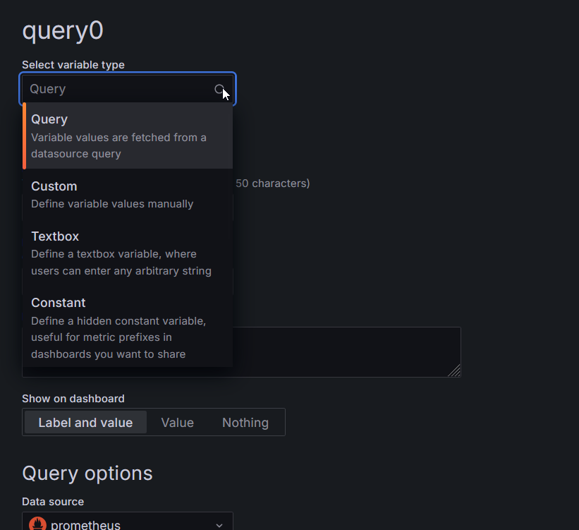
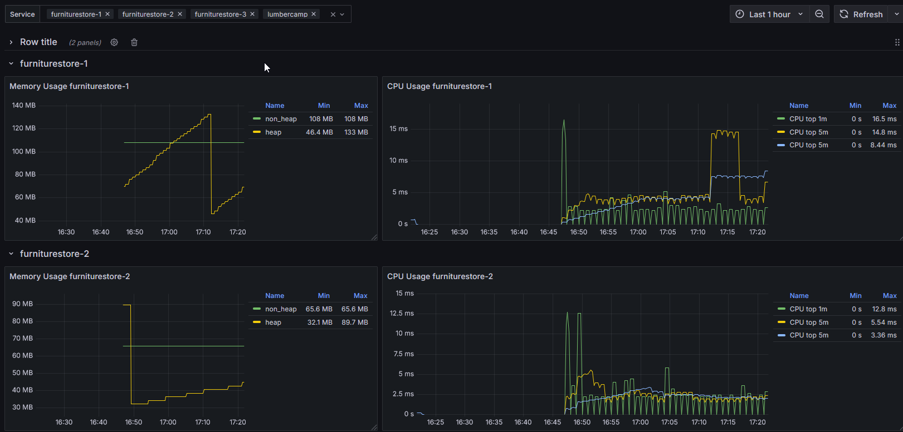

# Un dashboard un peu plus générique

## Configuration du dashboard

On aimerait voir s'il y a une corrélation entre la consommation CPU et la mémoire. Pour le moment, lors du survol d'un point du graph des CPU, on voit seulement les valeurs du TOP et pas de la mémoire.

Allez faire un tour dans le premier onglet **General** des **Dashboard Settings** pour voir s'il y a quelque chose d'intéressant.

L'idée est de pouvoir facilement faire des corrélations entre les widgets.

Ici par exemple, on remarque que lorsque la mémoire baisse, le CPU augmente (avec un léger temps de retard dû à notre **rate** glissant). C'est l'effet du Garbage collector Java qui vient nettoyer la *Heap* à intervalle régulier.

On a maintenant un Dashboard qui nous permet d'afficher les informations CPU et mémoire pour l'une de nos applications.

!!! tip "Paramètres généraux du dashboard"

    On peut ici paramétrer des informations sur le dashboard (Lecture seule, tags, description ...)

    On peut aussi changer les fréquences de rafraîchissement du dashboard, voire masquer la possibilité de changer la plage de temps consultée.

### Annotations

Ici, on peut configurer des alertes qui seront matérialisées directement sur les graphs.

### Variables

Patience, on va y revenir.

### Versions

Grafana stocke les différentes versions des dashboards en base de données. Il est possible de restaurer les versions précédentes et d'auditer les modifications.

### Permissions

Rien de bien fou, mais à noter que l'on peut gérer les permissions assez finement sur chaque dashboard en plus de celles au niveau de l'organisation.

### JSON Modèle

Les Dashboards sont décrits en JSON et il est possible de réaliser les exports et imports. Il existe d'ailleurs un [marketplace](https://grafana.com/grafana/dashboards/) de dashboards pour Grafana.

On fait les autres ?

## Les rows

Pour le moment, un seul service est affiché. Ce n'est pas très générique.

Revenez sur le dashboard. On va rajouter un élément de présentation sur notre dashboard : les *rows*.

Cet élément de présentation permet de ranger les différentes visualisations. Pour ajouter une visualisation dans une ligne, il faut au préalable déplier la ligne pour les affecter à cette ligne.

Chaque ligne a un titre. Il y a aussi une option qui pourrait nous intéresser ici : *Repeat for*.

Pour ça, il est nécessaire de définir des *variables*.

## Les variables

L'idée ici est de [variabiliser](https://grafana.com/docs/grafana/latest/dashboards/variables/) le **service_name**.

Pour ça, on peut, comme pour les requêtes des visualisations, sélectionner une datasource. La requête doit être adaptée au type de *datasource*.

Avec Prometheus, on peut aussi bien utiliser les valeurs de chaque métrique mais on peut aussi utiliser les *labels*.

Il faut créer une variable qui s'appelle *service_name* et dont les valeurs sont celles du label *service_name*.

Ensuite, sur le dashboard, on va activer les répétitions sur les rows pour itérer sur les valeurs de notre nouvelle variable.

!!! tip "Les variables utilisation avancée"

    Il est possible d'utiliser les variables comme label. Plus de détails [ici](https://grafana.com/docs/grafana/latest/dashboards/variables/variable-syntax/#variable-syntax) 

Il ne nous reste plus qu'à changer nos requêtes pour intégrer cette variable au lieu de la valeur de *Lumbercamp* et nous voici avec un Dashboard paramétrable, qui affichera toutes les applications à l'instant T. Si de nouvelles applications apparaissent, comme la requête associée à notre variable se base sur la même plage de temps que notre dashboard, on va pouvoir les afficher.

!!! tip "Édition et répétition"

    Attention, si vous souhaitez modifier une visualisation sur laquelle est active une répétition, il faut faire la modification sur la première instance. Le menu d'édition n'est pas disponible sur les instances suivantes.

**🛫 Prochaine étape : Dashboard Business [➡️](../dashboard-business/README.md)**