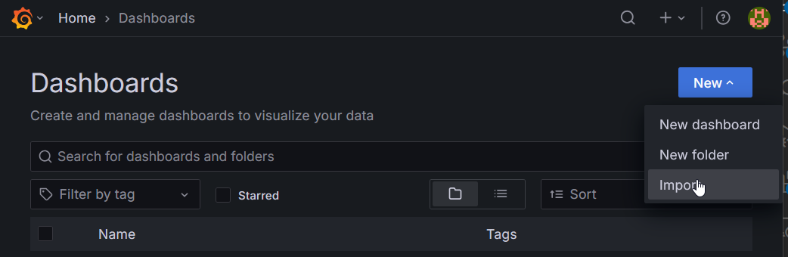
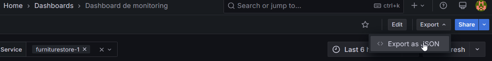

# On va quand même pas tout faire tout seul ?

## La communauté

Grafana met à disposition des utilisateurs le site [Grafana Dashboards](https://grafana.com/grafana/dashboards/){target="_blank"} qui regroupe des dashboards partagés par la communauté. Il est possible de les importer directement dans Grafana.



Il est possible de faire l'import soit directement au format JSON, soit en indiquant l'ID du dashboard qui est affiché sur le site de Grafana.

## Les imports JSON

Pour exporter un de vos dashboards, il suffit de cliquer sur le bouton `Export as JSON` dans le menu `Export` du dashboard.


Le bouton `Export the dashboard to use in another instance` permet de créer une zone input qui, lors de l'import du dashboard, va permettre de choisir les sources de données à utiliser pour le dashboard.

Cela permet de ne pas *hardcoder* les noms des datasources dans le JSON du dashboard mais de tout de même spécifier le type de datasource à utiliser.


Ici, lors de l'import, un formulaire est présenté pour choisir une datasource de type `Prometheus`.

### Importez les dashboards suivants

On vous a préparé quelques dashboards exemples :

???note "DashBoardMonitoring.json"
    ``` { .json .copy }
        --8<-- "dashboards/DashBoardMonitoring.json"
    ```

???note "Perf DB.json"
    ``` { .json .copy }
        --8<-- "dashboards/Perf DB.json"
    ```

???note "Perf Code.json"
    ``` { .json .copy }
        --8<-- "dashboards/Perf Code.json"
    ```

???note "Perf API.json"
    ``` { .json .copy }
        --8<-- "dashboards/Perf API.json"
    ```

Prenez le temps de manipuler les dashboards et de comprendre comment ils fonctionnent.

// TODO : on attend quoi ?

**🛫 Prochaine étape : Otel (*aka OpenTelemetry*) [➡️](../dashboard-metrics/otel.md)**
