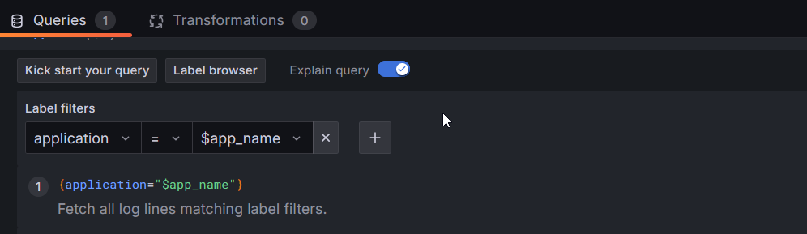
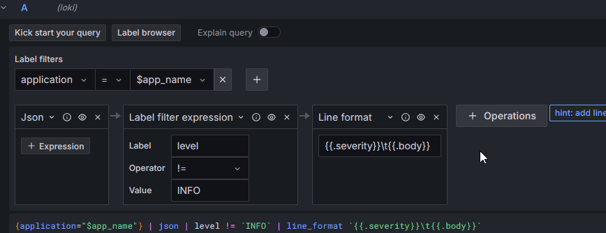
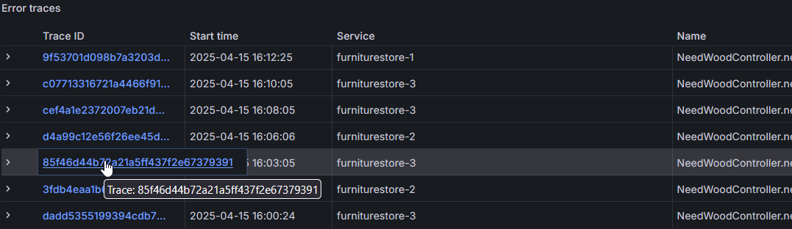
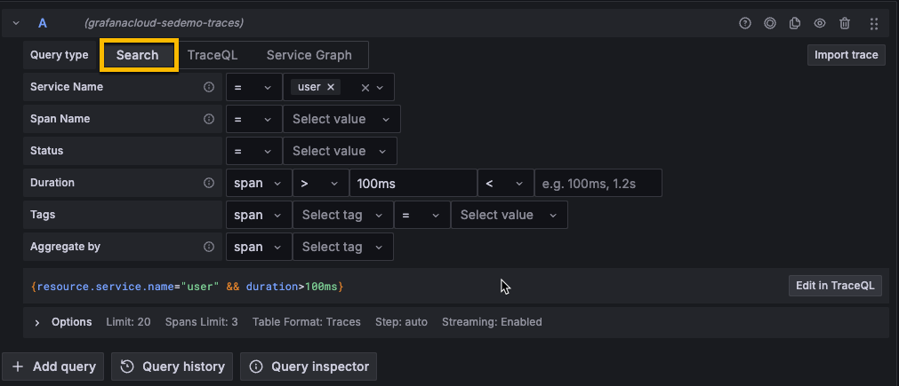
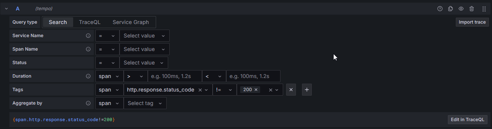
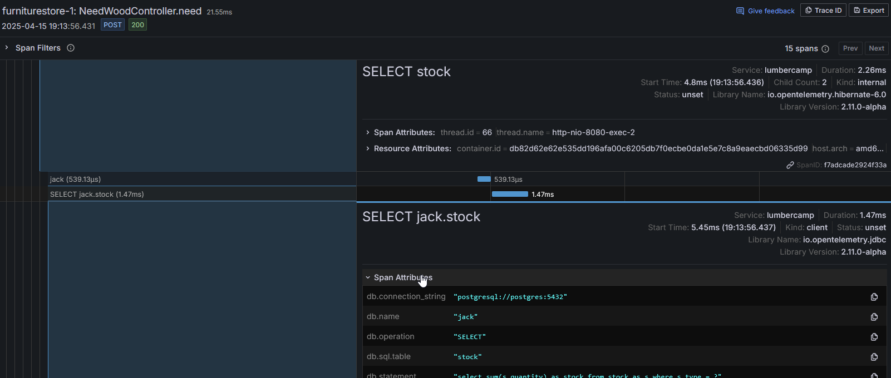

# 🕵️ Grafana et les logs / traces

Quand on parle de monitoring, on distingue souvent trois types de données :

* Les métriques
* Les logs
* Les traces

Nous avons déjà vu comment afficher les métriques dans Grafana en s'appuyant sur `Prometheus`, mais il est aussi possible d'afficher les logs et les traces.

## Ajout des DS Loki et Tempo

Pour celà on vas configurer Grafana pour qu'il puisse se connecter à [Loki](https://grafana.com/oss/loki/){target="_blank"} et [Tempo](https://grafana.com/docs/tempo/latest/){target="_blank"}.

Objectifs:

* Si ce n'est pas déjà fait la datasource pour `Prometheus` [ici](README.md#prometheus)
* Une data source pour se connecter à l'instance `Loki` (Le storage pour nos logs)

    | Information     | Value       |
    |-----------------|-------------|
    | Name            | loki  |
    | URL             | http://loki:3100 |
    | Authentication methods | No Authentication |
    | Skip TLS certificate validation    | true     |

* Une data source pour se connecter à l'instance `Tempo` (le storage pour les traces)

    | Information     | Value       |
    |-----------------|-------------|
    | Name            | tempo  |
    | URL             | http://tempo:3200 |
    | Authentication methods | No Authentication |
    | Skip TLS certificate validation    | true     |
    | Trace to metrics DS | prometheus |
    | Trace to Logs DS | loki |

Les logs sont ici gérés par Grafana `Loki` et les traces par Grafana `Tempo`. Nous allons importer le dashboard suivant pour manipuler les logs et les traces.

???note "Observability Sample.json"
    ``` { .json .copy }
        --8<-- "dashboards/Observability Sample.json"
    ```
Deux visualizations sont disponibles avec ce Dashboard.

## Logs

La première est la wid `Log` qui va permettre d'afficher les résultats de nos requêtes vers `Loki`

Utilisez la fonction *Explain Query* pour obtenir de l'aide sur ce que fait cette requête



Pour aller plus loin sur la configuration des logs c'est par [ici](https://grafana.com/docs/grafana/latest/panels-visualizations/visualizations/logs/){target="_blank"}.

On utilise Loki comme stockage mais il est possible de faire la meme chose avec Elastic, InfluxD ou autre.

!!!success "On n'affiche pas les logs INFO"
    On va ici modifier la requête pour masquer les logs au niveau INFO

    ℹ️ C'est surement case sensitive

???danger "Spoiler la solution est là"
    On ajoute simplement un filtre sur le label `level` pour exclure la valeur *INFO*
    

## Traces

Les traces permettent de visualiser une succession d'évènements.

Une trace est consitituée de *N* **Spans** qui correspondent à une action.

Ici nous utilisons l'agent OpenTelemetry sur les applications Java pour les outiller. C'est l'instrumentation automatique de l'agent qui définit les spans.

Il est aussi possible de définir ces spans par développement dans l'application en utilisant [la librairie OTEL](https://opentelemetry.io/docs/concepts/instrumentation/libraries/){target="_blank"}. Elle est disponible dans [plusieurs langages](https://opentelemetry.io/docs/languages/){target="_blank"}.

Pour afficher les traces, pas de visualization spécifique mais un tableau est suffisant. L'idée ici est de lister l'ensemble des traces que l'on à collecté.



Il est possible de configuer la query pour ne retenir que certains traces. Le builder permet de faire facilement des filtres, sans forcement maitriser la syntaxe de `Tempo`. Plus de détails sur cet écran dans la doc officiel sur [traceql](https://grafana.com/docs/grafana/next/datasources/tempo/query-editor/traceql-search/){target="_blank"} de Grafana.



!!!success "On va filtrer uniquement sur les traces d'erreur"
    On va dupliquer la visualization et rajouter un filtre pour n'afficher que les traces avec un status code différent de 200.

???danger "Spoiler la solution est là"
    
    ou alors directement en traceQL : `{span.http.response.status_code!=200}`

## On explore les traces ?

Pour aller plus loin avec les traces on peux, en cliquant sur le lien avec l'ID de la Trace ou de la Span acceder à la page de détail de la trace.

On retrouve ici les différents spans qui compose la trace, les temps de traitement de chaque span. Assez pratique pour diagnostiquer les problèmes en production :



**🛫 Prochaine étape : Plugin Infinity & API [➡️](../dashboard-plugin/README.md)**