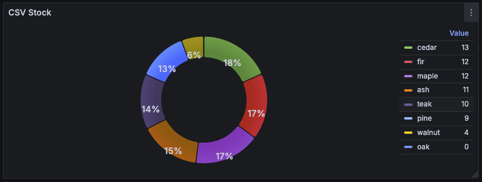
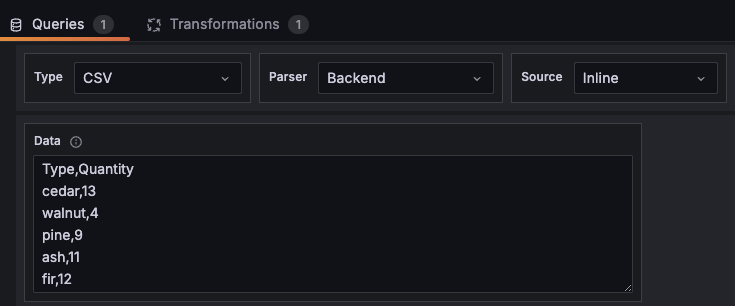
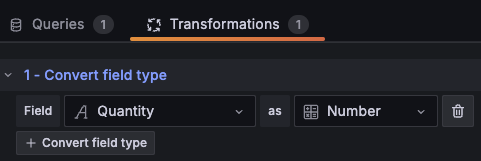

# Dashboard "Infinity"

L'écosystème Grafana est riche de plugins, ... Il existe de nombreux plugins disponibles sur le site de Grafana. Certains permettent d'ajouter des visualizationss **panels**, d'autres des **datasources** ou encore des applications **Apps**. Les **Apps** sont des plugins plus complexes qui permettent d'ajouter des fonctionnalités avancées à Grafana.

Tout comme pour la dashboard Grafana fournit une page [web](https://grafana.com/grafana/plugins/){target="_blank"} permettant de visualiser les plugins disponibles, il est possible de filtrer par type de plugin (datasource, panel, app, ...).

La configuration est accessible par le menu `Administration > Plugins and data > Plugins` dans Grafana.

Il est possible d'installer des plugins directement depuis l'interface de Grafana ou en ligne de commande.

Celui de *Infinity* est l'un des plus complets car offrant de nombreux use cases :

- Datasources : JSON API, CSV, TSV, XML, GraphQL, HTML, Google Sheets and HTTP/REST API, RSS/ATOM
- Transformations des données avec UQL/GROQ
- Diverses méthodes d'authentification :
  - Basic authentication
  - API key authentication
  - OAuth2 client credentials / JWT authentication
  - AWS/Azure/GCP authentication

!!!Note "📖 Doc plugin"
    La documentation est disponible sur le [site de Grafana](https://grafana.com/docs/plugins/yesoreyeram-infinity-datasource/latest/){target="_blank"}.

## Installation

Il faut tout d'abord installer le plugin. Pour cela, aller dans `Connections > Add new connection` et rechercher `infinity`. Puis installer le plugin.

{width="300"}

???example "Air Gap Installation"
    Il est possible d'installer le plugin en utilisant le [zip](https://storage.googleapis.com/integration-artifacts/yesoreyeram-infinity-datasource/3.2.0/main/36ba223489266ddb4fa6f0d955f9e36af7983ae8/yesoreyeram-infinity-datasource-3.2.0.linux_amd64.zip) directement télécharger depuis le site.

    Il faut ensuite le dézipper pour obtenir l'arborescence suivante:
    

    `.docker/config/grafana-provisioning/plugins/yesoreyeram-infinity-datasource`
    
Une fois installé, vous pouvez ajouter une nouvelle *DataSource*:

Le plugin dispose de nombreuses possibilités de configuration.

## Mode API

### Configuration

Dans ce premier cas, on va configurer la connexion à une API HTTP car dans la vraie vie, il est fort possible que l'on ait pas accès directement à la BDD comme nous l'avons fait dans les premières étapes du lab.

On configure donc la connexion à l'API `stock` de notre service `lumbercamp`:

On valide que tout est ok via le bouton `Save & Test`

!!!success
    

Cliquez maintenant sur `Explore view` pour voir les données disponibles via l'API

On observe que l'on a bien les données en temps réel du stock:

### Création du dashboard

Retournez dans `Dashboard` et ajoutez un nouveau intitulé `API`.

Ajoutez une visualization utilisant notre nouvelle datasource `api-lumbercamp`:

- type `Pie chart`
- affichant les portions avec leur pourcentage par type de bois

!!!success
    

Il serait aussi intéressant d'avoir une visualization montrant les stocks "à risque" facilement.

En dupliquant la visualization précédent, configurez-en un nouveau n'affichant que les stocks en-dessous de 30 pièces disponibles.

!!!success
    

???danger "Spoiler la solution est là"
    * Widget de type "Bar gauge" en affichage horizontal
    * 2 transformations
        * Filtrer les stocks supérieurs à 30
        * Ordonner les données en mode décroissant
    * Configurer les thresholds
        * `Base` en rouge
        * `30` en orange

## Mode CSV

Il est encore fréquent que l'on est des donnéees exportées au format CSV. Le plugin infinity permet de gérer ce format de données comme expliqué en introduction.

### Configuration datasource

On reconfigure une nouvelle datasource Infinity que l'on peut nommer `infinity-csv`. Pas besoin de remplir quoique ce soit d'autres cette fois-ci.

### Création du dashboard

On crée un nouveau dashboard `CSV` pour héberger nos visualizations de données issues de CSV.

Dans ce nouveau dashboard, ajoutez une visualization utilisant la nouvelle datasource `infinity-csv` pour avoir le désormais classique `Pie Chart` avec l'étape des stocks que l'on peut récupérer dans un navigateur via l'[API csv stock](http://localhost:8080/api/stock/csv)

!!!success "CSV chargé et interprété"
    On obtient la visualization suivante

    

???danger "Spoiler la solution est là"
    Dans la visualization, il faut :

    * mettre le type à `CSV`
    * mettre la source à `Inline`
    * copier le contenu du csv téléchargé dans `Data`

    

    * créer une transformation pour que le champ `Quantity` soit interprété comme un `Number`

    

    * mettre le mode `Donut` plutôt que `Pie` pour changer un peu

!!!info "Plusieurs sources possibles"
    On remarque qu'en plus d'`Inline`, il y a d'autres sources possibles tel qu'`Azure blob` pour récupérer un fichier qui serait générer périodiquement sur un storage cloud.

### Bascule sur le mode API

On peut aussi imaginer que le CSV soit disponible via une API.

Modifier la configuration de la visualization pour qu'elle utilise l'API plutôt que des données statiques et ainsi bénéficier de la possibilité d'avoir du rafraîchissement automatiquement

!!!success "Visualization fonctionne toujours"
    La visualization fonctionne et en activant le rafraîchissement automatique toutes les 5s, les données sont bien mises à jour.

???danger "Spoiler la solution est là"
    Il suffit de changer la source avec la valeur `URL` et configurer l'url de l'API utilisée pour récupérer le csv : `http://lumbercamp:8080/api/stock/csv`