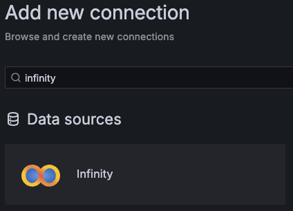
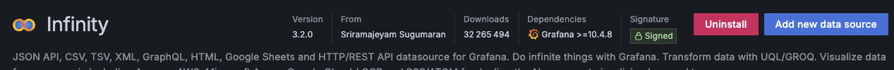
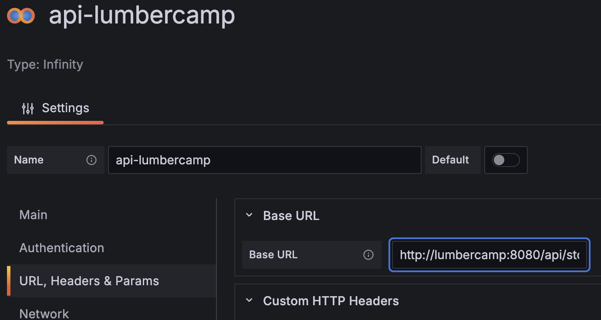
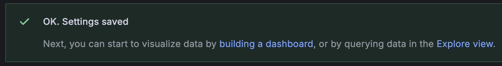
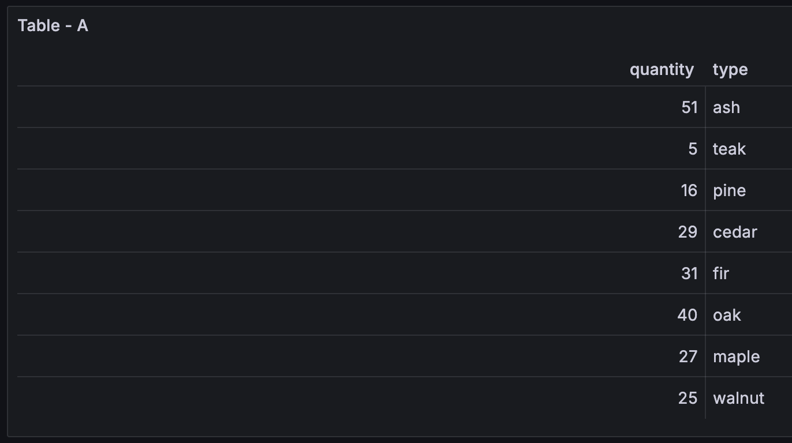
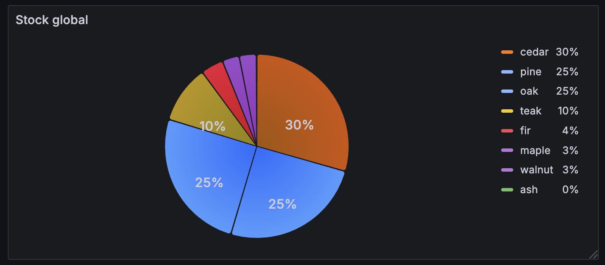
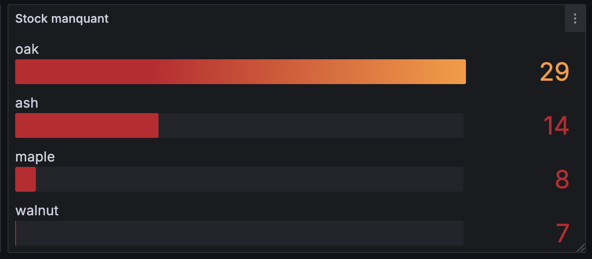

# Dashboard "Infinity"

L'écosystème Grafana est riche de plugins, ... Il existe de nombreux plugins disponibles sur le site de Grafana. Certains permettent d'ajouter des visiualisations **panels**, d'autre des **datasources**  ou encore des applications **Apps**. Les **Apps** sont des plugins plus complexes qui permettent d'ajouter des fonctionnalités avancées à Grafana.

Tout comme pour la dashboard Grafana fournit une page [web](https://grafana.com/grafana/plugins/) permettant de visualiser les plugins disponibles. Il est possible de filtrer par type de plugin (datasource, panel, app, ...).

La configuration est accessible par le menu `Administration > Plugins and data > Plugins` dans Grafana.

Il est possible d'installer des plugins directement depuis l'interface de Grafana ou en ligne de commande.

Celui de *Infinity* est l'un des plus complets car offrant de nombreux use cases :

- Datasources : JSON API, CSV, TSV, XML, GraphQL, HTML, Google Sheets and HTTP/REST API, RSS/ATOM
- Transformations des données avec UQL/GROQ
- Diverses méthodes d'authentification :
  - Basic authentication
  - API key authentication
  - OAuth2 client credentials / JWT authentication
  - AWS/Azure/GCP authentication

!!!Note "📖 `Man yesoreyeram-infinity-datasource`"
    La documentation est disponible sur le [site de Grafana](https://grafana.com/docs/plugins/yesoreyeram-infinity-datasource/latest/){target="_blank"}.

## Installation

Il faut tout d'abord installer le plugin. Pour cela, aller dans `Connections > Add new connection` et rechercher `infinity`. Puis installer le plugin.

{width="300"}

???example "Air Gap Installation"
    Il est possible d'installer le plugin en utilisant le [zip](https://storage.googleapis.com/integration-artifacts/yesoreyeram-infinity-datasource/3.2.0/main/36ba223489266ddb4fa6f0d955f9e36af7983ae8/yesoreyeram-infinity-datasource-3.2.0.linux_amd64.zip) directement télécharger depuis le site.

    Il faut ensuite le dézipper pour obtenir l'arborescence suivante:
    

    `.docker/config/grafana-provisioning/plugins/yesoreyeram-infinity-datasource`
    
Une fois installé, vous pouvez ajouter une nouvelle *DataSource*:

Le plugin dispose de nombreuses possibilités de configuration.

## Configuration d'une API

Dans notre cas, on va configurer la connexion à une API HTTP car dans la vraie vie, il est fort possible que l'on ait pas accès directement à la BDD comme nous l'avons fait dans les premières étapes du lab.

On configure donc la connexion à l'API `stock` de notre service `lumbercamp`:

On valide que tout est ok via le bouton `Save & Test`

!!!success
    

Cliquez maintenant sur `Explore view` pour voir les données disponibles via l'API

On observe que l'on a bien les données en temps réel du stock:

## Configuration du dashboard

Retournez dans `Dashboard` et ajoutez un nouveau intitulé `API`.

Ajoutez une visualisation utilisant notre nouvelle datasource `api-lumbercamp`:

- type `Pie chart``
- affichant les portions avec leur pourcentage par type de bois

!!!success
    

Il serait aussi intéressant d'avoir une visualisation montrant les stocks "à risque" facilement.

En dupliquant le widget précédent, configurez-en un nouveau n'affichant que les stocks en-dessous de 30 pièces disponibles.

!!!success
    

???danger "Spoiler la solution est là"
    * Widget de type "Bar gauge" en affichage horizontal
    * 2 transformations
        * Filtrer les stocks supérieurs à 30
        * Ordonner les données en mode décroissant
    * Configurer les thresholds
        * `Base` en rouge
        * `30` en orange