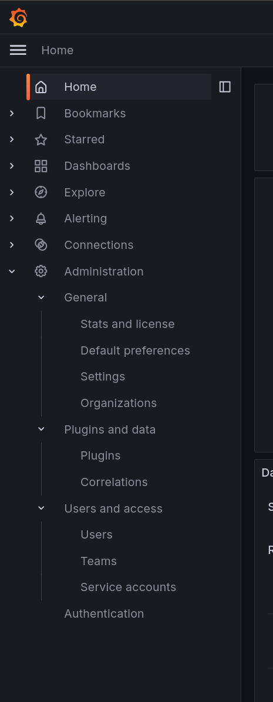
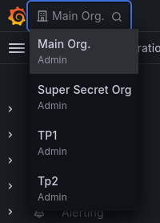
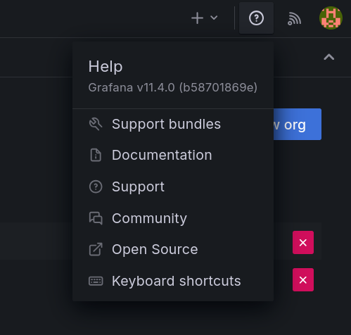

# 🚂 Présentation de l'application

## Introduction à Grafana et ses menus principaux

Dans ce chapitre, nous allons nous familiariser avec les différents menus de configuration accessibles depuis l'interface de Grafana.

Nous n'explorerons pas en détail les menus d'administration par la suite, mais il est important de les connaître.

Voici les principaux menus que vous utiliserez dans Grafana :

Sur le côté gauche de l'application :

{ align=left }

### **Home**

La page d'accueil qui vous permet d'accéder rapidement à vos tableaux de bord favoris et d'explorer les options de configuration générales.

### **Dashboards**

Cette section permet de gérer vos tableaux de bord : création et liste des dashboards existants.

Les menus **Bookmarks** et **Starred** permettent de retrouver rapidement les tableaux de bord que vous avez marqués comme favoris.

### **Explore**

Un outil interactif pour analyser rapidement vos données (idéal pour le dépannage rapide).

Nous en parlerons plus en détail dans un prochain chapitre.

### **Alerting**

Configurez des alertes pour surveiller vos données et être notifié en cas d'anomalies.

Nous en parlerons plus en détail dans un prochain chapitre.

### **Connections**

Grafana ne fournit pas de sources de données et n'est pas responsable du stockage.

Il se connecte uniquement à ces **data sources** pour afficher les données. Dans notre TP, nous aurons l'occasion de jouer avec les sources de données les plus courantes.

On verra qu'il n'y a pas de langage de requête spécifique à Grafana, il utilise le langage de requête de la source de données.

### **Administration**

Permet de configurer les différents aspects de Grafana :

* **General** : En plus des menus de configuration, on trouve ici la notion d'**Organization**. C'est le plus haut niveau de ségrégation de Grafana.

{ align=left } Une **Organization** représente un tenant de votre instance. Il est possible d'y affecter des utilisateurs et de leur donner des droits d'administration / éditeur / consultation.

Toutes les ressources d'une organisation sont isolées des autres organisations. Il n'est pas possible de partager une datasource ou un dashboard entre deux organisations. Cette ségrégation présente quelques limitations, mais elle a le mérite de faire partie de la version gratuite de Grafana.

Si vous êtes membre de plusieurs organisations, vous pouvez changer d'organisation en cliquant sur le nom de l'organisation en haut à gauche de l'interface.

* **Plugins** : Installez des plugins pour étendre les fonctionnalités de Grafana (widgets, datasources, extensions).
* **Users** : Gérez les utilisateurs et les permissions. Il est possible de regrouper les utilisateurs en **Teams** pour faciliter la gestion des droits.
* **Authentification** : Permet de configurer les différents modes d'authentification (LDAP, OAuth, etc.)

{ align=right }

## **Help**

Un espace pour accéder à la documentation et aux ressources d'aide :

* **Community Support** : Rejoignez la communauté Grafana.
* **Documentation** : Lisez les guides officiels pour approfondir vos connaissances.

## Accès à votre profil

Gestion de la langue, des fuseaux horaires, des mots de passe, etc.

## Mais encore ?

Bon ... Et si on commençait notre workshop ?

**🛫 Prochaine étape : Notre Organisation [➡️](../organisation/README.md)**
