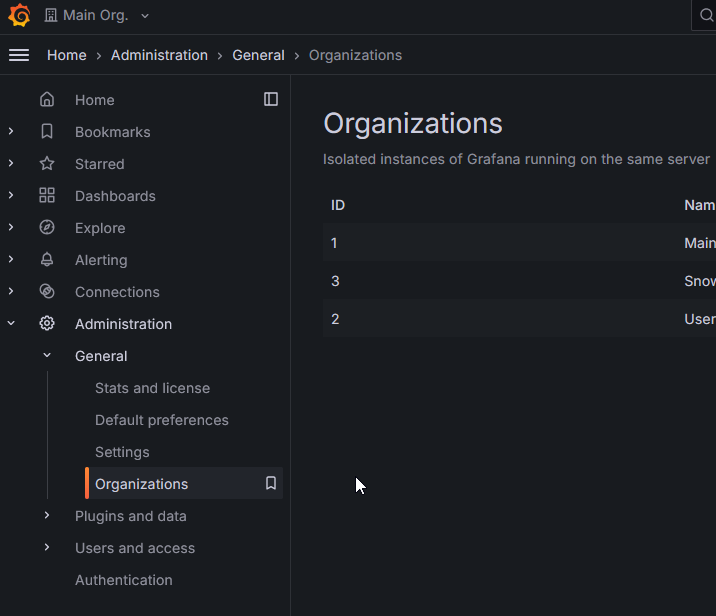
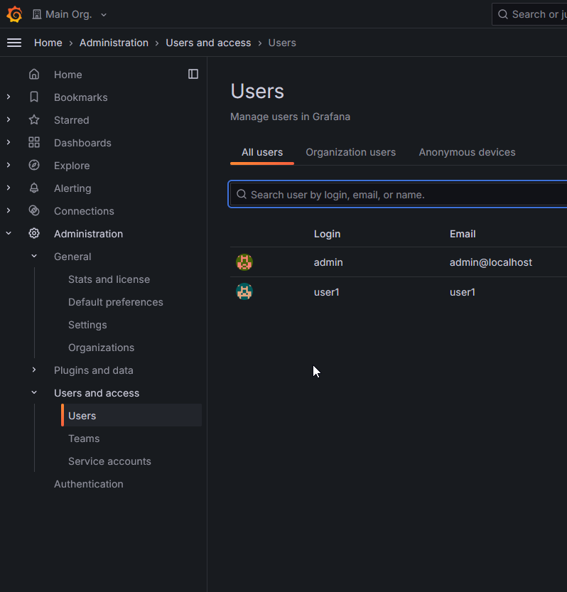
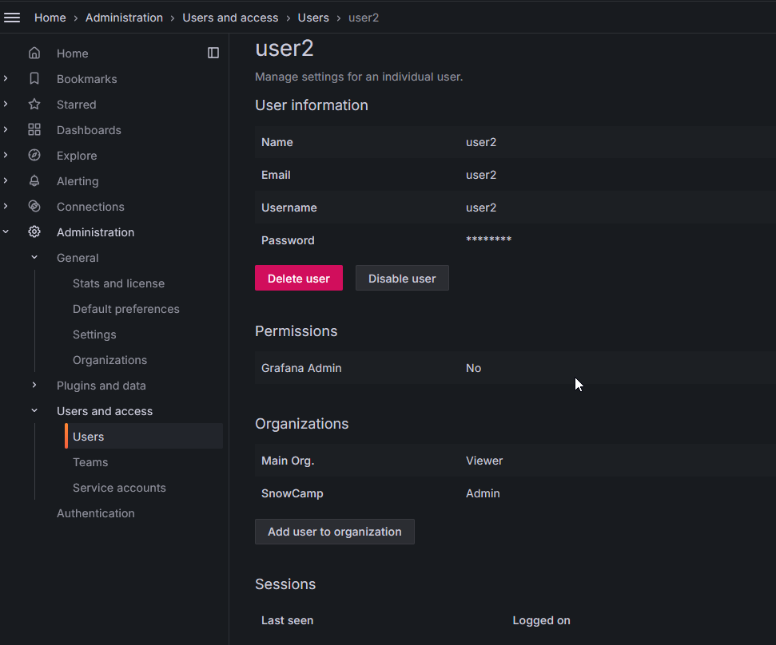

# Les organisations

On va commencer par créer une nouvelle organisation et un utilisateur admin de cette organisation.

On utilisera cet utilisateur pour faire la suite du tutoriel.

## L'organisation

Dans le menu *Administration*>*General*>*Organizations*, on peut créer une nouvelle organisation.

## Création des utilisateurs

On va pouvoir créer un utilisateur pour cette organisation.

Et lui attribuer le rôle d'administrateur de celle-ci.

Vous pouvez maintenant vous déconnecter et vous reconnecter avec cet utilisateur.

**🛫 Prochaine étape : Mon premier Dashboard [➡️](../labs.md)**