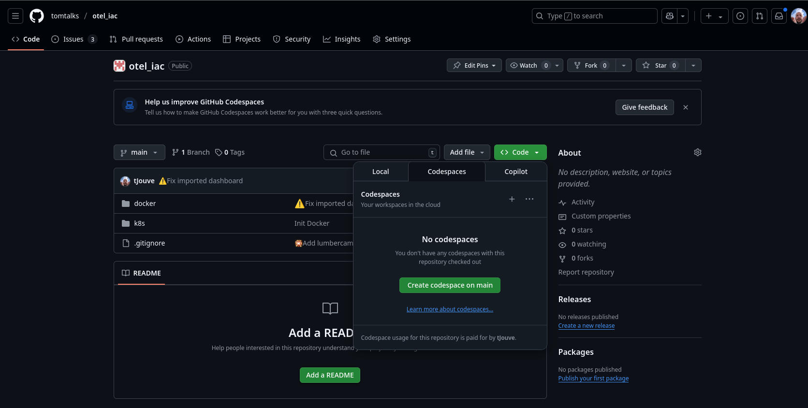
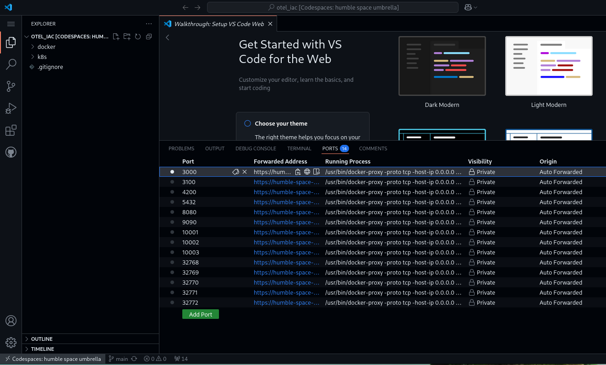

# 🎉 Préparation de l'environnement 🛠️

## 🏡 En local

Pour démarrer, nous allons installer Docker et lancer le stack Docker Compose préparé pour ce workshop.

### 1. Installer Docker

Docker est indispensable pour exécuter les différents services de notre workshop.

Si vous avez déjà Docker (et Docker Compose) installé, vous pouvez directement vous rendre à l'étape [Cloner le projet](#3-cloner-le-projet).

Sinon, suivez les instructions ci-dessous en fonction de votre système d'exploitation :

#### 🪟 Windows

Attention, pour un usage professionnel, une licence est requise pour Docker Desktop. Si vous n'en avez pas, utilisez [WSL](#windows-avec-wsl2).

1. Téléchargez [Docker Desktop pour Windows](https://docs.docker.com/desktop/setup/install/windows-install/).
2. Installez Docker Desktop en suivant les étapes de l'assistant.
3. Assurez-vous que Docker est en cours d'exécution après l'installation (vérifiez l'icône Docker dans la barre des tâches).

##### 🪟🐧 Windows avec WSL2

1. Installez WSL2 et configurez-le comme version par défaut si ce n'est pas encore fait. Suivez [ce guide](https://docs.microsoft.com/fr-fr/windows/wsl/install) pour l'installation.
2. Assurez-vous que votre distribution par défaut utilise WSL2.
   ```bash
   wsl --list --verbose
   ```
3. Suivez les instructions pour [Linux](#linux).
4. Dans votre terminal WSL, testez Docker avec :
   ```bash
   docker --version
   ```

#### 🍏 MacOS

1. Téléchargez [Docker Desktop pour Mac](https://docs.docker.com/desktop/setup/install/mac-install/).
2. Installez l'application en déplaçant Docker dans le dossier Applications.
3. Lancez Docker Desktop et vérifiez que Docker fonctionne (l'icône Docker doit être visible dans la barre de menus).

#### 🐧 Linux

Installez Docker via votre gestionnaire de paquets. Par exemple, sur [Ubuntu](https://docs.docker.com/engine/install/ubuntu/).

### 2. Installer Docker Compose

Docker Compose est inclus dans Docker Desktop sur Windows et macOS. Pour Linux, installez-le comme suit :

```bash
sudo apt-get install -y docker-compose-plugin
```

Vérifiez que Docker Compose est installé :

```bash
docker compose version
```

### 3. Cloner le projet

Récupérez le repository contenant le stack Docker Compose :

```bash
git clone https://github.com/tomtalks/otel_iac
cd otel_iac
```

## ☁️ Avec Code Space

Vous pouvez utiliser Code Space sur [ce repository](https://github.com/tomtalks/otel_iac){target="_blank"}



Docker est Docker Compose sont déjà installés.

!!!success "Done"

## 🚀 Lancer la stack Docker Compose

### 1. Lancer Docker Compose

Dans le répertoire cloné, lancez le stack Docker Compose :

```bash
cd docker
docker compose up -d
```

Cette commande va démarrer :

* Une base de données PostgreSQL 🐘
* Un backend Java avec OpenTelemetry ☕
* Trois applications clientes du backend ☕
* Un conteneur Grafana

### 2. Vérifier que tout fonctionne

Pour vérifier que vos services sont bien lancés, utilisez la commande suivante :

```bash
docker compose ps
```

Vous devriez voir tous les services avec l'état `Up`.

### 3. Accéder à Grafana

Les identifiants par défaut sont :

* **Utilisateur** : `admin`
* **Mot de passe** : `admin`

!!! note "À la connexion, vous êtes invité à changer le mot de passe de l'utilisateur"

    Ne le faites pas et cliquez sur le lien **Skip** en bas de la page.

### 🏡 En local 

Une fois le stack lancé, ouvrez votre navigateur et rendez-vous à l'adresse suivante :

```
http://localhost:3000
```

### ☁️ Avec Code space 

Si vous utilisez un Code Space, l'url est affichée dans l'onglet Ports.



**🚀 Bravo !** Vous êtes prêts à explorer Grafana et à créer vos premiers tableaux de bord !

**🛫 Prochaine étape : Introduction à Grafana [➡️](../intro/README.md)**
