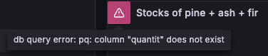
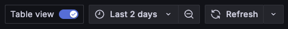
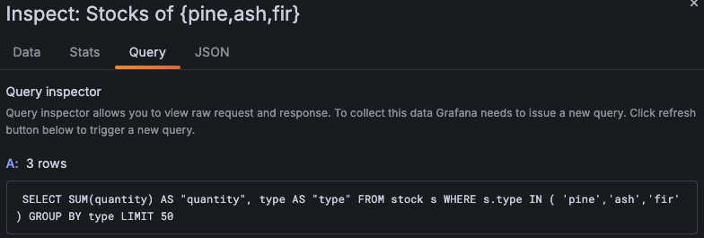
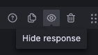

# 🛟 Astuces

Sur cette page quelques astuces pour vous aider à débugger, vous débloquer...

## 🔺 Le triangle rouge

Si votre visualization ne s'affiche pas, souvent il y a un triangle rouge qui apparait et vous donne l'erreur

## 🖼️ Mode `Table view`

Si vous ne comprenez pas les données affichées par la visualization ou si il n'y a rien qui s'affiche, un moyen simple est de passer en `Table view` pour voir les données qui servent à afficher le graphique.

## 🤔 Afficher la requête executée

Si on a un doute sur les données remontées, via les "3 points" en haut à droite de la visualization puis `Inspect > Query` on peut voir la requête executée (très pratique en particulier quand on fait du SQL)

## 🙈 Masquer certaines étapes (query ou transformation)

Dans certains cas, on va enchainer/combiner plusieurs *Query* et/ou *Transformation*. Pour faciliter le debug, on a la possibilité de désactiver une ou plusieurs d'entre elles via le bouton "oeil". Cela permet de voir où le problème se situe

