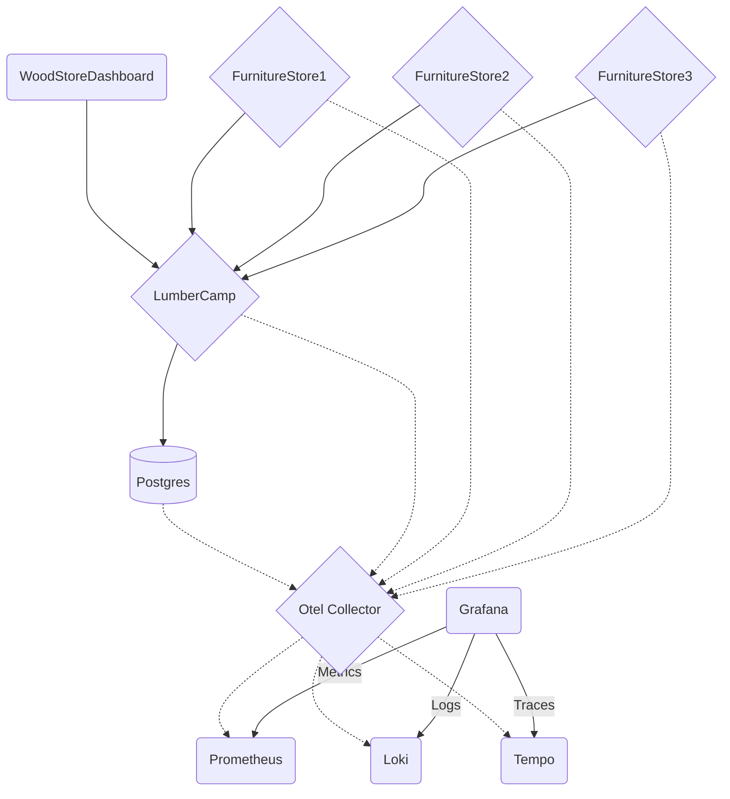

# 🪵 Un dashboard Grafana qui claque 🌟

Bienvenue dans ce workshop sur Grafana ! L'objectif est de vous faire découvrir et manipuler Grafana en exploitant les données d'une application de gestion de commandes de bois. Vous aurez à votre disposition une base de données PostgreSQL, un backend Java avec OpenTelemetry, ainsi que trois applications frontend simulant des magasins de fournitures.

## Vous avez à votre disposition une application contenant un front, plusieurs back et une base de données Postgres.



## Composants de l'application

- **Wood Store Dashboard** : Le front de l'application qui affiche les stocks
- **Furniture Store** : Plusieurs back permettant de modifier les stocks de manière autonome
- **Lumber Camp** : Une API pour modifier les stocks et les commandes dans l'application
- **Postgres** : La base de données

## Composants de la stack d'observabilité

- **Otel Collector** : L'API permettant d'envoyer nos métriques, logs et traces
- **Prometheus** : La base de données pour les métriques
- **Loki** : La base de données pour les logs
- **Tempo** : La base de données pour les traces
- **Grafana** : L'outil de visualisation pour voir les métriques, logs et traces

## Introduction à Grafana et ses menus principaux

Grafana est une plateforme puissante de visualisation et de surveillance qui permet d'exploiter efficacement vos données grâce à des tableaux de bord interactifs. Voici les principaux menus que vous utiliserez dans Grafana :

### 1. **Home**
La page d'accueil qui vous permet d'accéder rapidement à vos tableaux de bord favoris et d'explorer les options de configuration générales.

### 2. **Dashboards**
Cette section permet de gérer vos tableaux de bord :
- **Create** : Créez de nouveaux tableaux de bord pour visualiser vos données.
- **Browse** : Explorez et ouvrez les tableaux de bord existants.

### 3. **Explore**
Un outil interactif pour analyser rapidement vos données :
- Permet de filtrer et d'explorer les logs, les métriques, et les traces en temps réel.
- Idéal pour le dépannage rapide.

### 4. **Alerting**
Configurez des alertes pour surveiller vos données et être notifié en cas d'anomalies :
- Définissez des seuils d'alerte sur vos métriques.
- Gérez les canaux de notification comme les emails, Slack, ou autres.

### 5. **Configuration**
Permet de configurer les différents aspects de Grafana :
- **Data Sources** : Ajoutez et gérez vos sources de données (Prometheus, Loki, etc.).
- **Users** : Gérez les utilisateurs et les permissions.
- **Plugins** : Installez des plugins pour étendre les fonctionnalités de Grafana.

### 6. **Plugins**
Accédez aux extensions qui enrichissent Grafana :
- Ajoutez des visualizationss personnalisées.
- Connectez des intégrations supplémentaires.

### 7. **Help**
Un espace pour accéder à la documentation et aux ressources d'aide :
- **Community Support** : Rejoignez la communauté Grafana.
- **Documentation** : Lisez les guides officiels pour approfondir vos connaissances.

### 5. Vérifier que tout fonctionne

Pour vérifier que vos services sont bien lancés, utilisez la commande suivante :

```bash
docker-compose ps
```

Vous devriez voir tous les services avec l'état `Up`.

### 6. Accéder à Grafana

Une fois le stack lancé, ouvrez votre navigateur et rendez-vous à l'adresse suivante :

```
http://localhost:3000
```

Les identifiants par défaut sont :

- **Utilisateur** : `admin`
- **Mot de passe** : `admin`

**🚀 Bravo !** Vous êtes prêts à explorer Grafana et à créer vos premiers tableaux de bord !

**🛫 Prochaine étape : Configurer vos sources de données ****[➡️](sources-de-donnees.md)**

