# Mon premier dashboard

Nous allons maintenant manipuler un dashboard pour ajouter des widgets et avoir quelques visualisations.

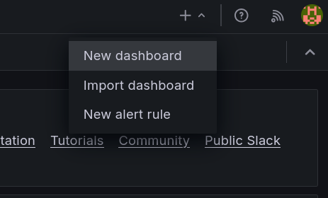{ align=right }

Pour le moment, nous allons commencer par un dashboard vide.

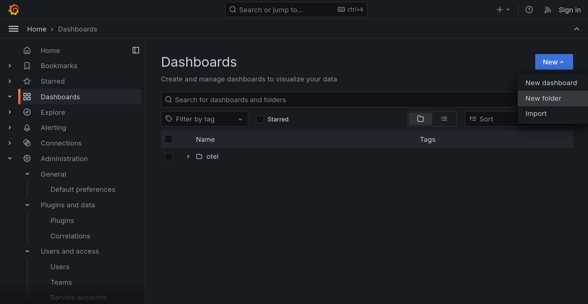{ align=left }

!!!info "Via le menu Dashboard"
    Il est aussi possible de passer par le menu dashboard.

    Il est alors possible de créer des répertoires pour organiser vos dashboards.
    
    🔐 Ces répertoires sont aussi utilisés pour donner des droits d'accès à des utilisateurs ou des équipes.

## Sélection de la datasource par défaut

On peut démarrer et choisir de créer une première "visualization" en cliquant sur **Add visualization**.

La première étape est de choisir une source de données pour notre dashboard.
ℹ️ Elle peut être modifiée plus tard

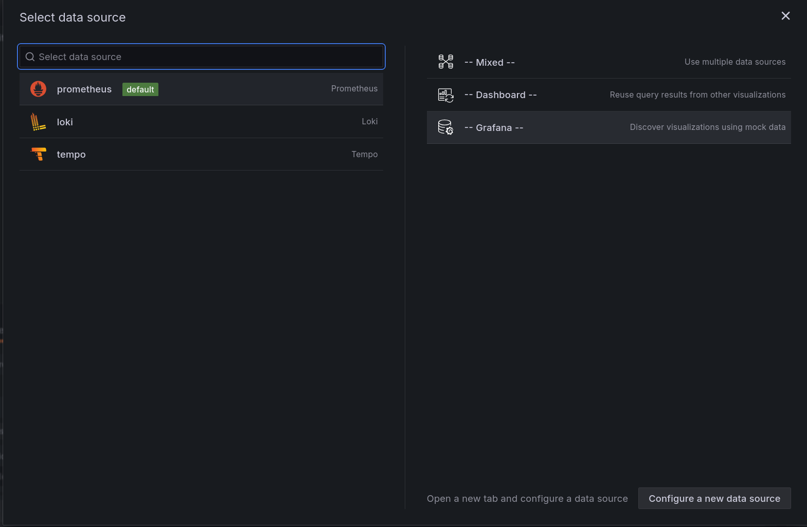

Dans un premier temps, nous allons choisir une data source particulière, une source de données Mock intégrée à Grafana :

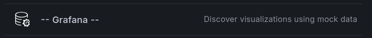

C'est une source de données qui génère des données aléatoires pour les métriques, les logs et les traces. Cela permet de tester les fonctionnalités de Grafana sans avoir à configurer une source de données réelle.

Elle nous permettra de voir comment fonctionne Grafana et de créer des visualisations de base.

## Visualization : la brique de base du dashboard

On arrive directement sur la création d'un panel de visualisation. Ils sont tous présentés de la même manière:

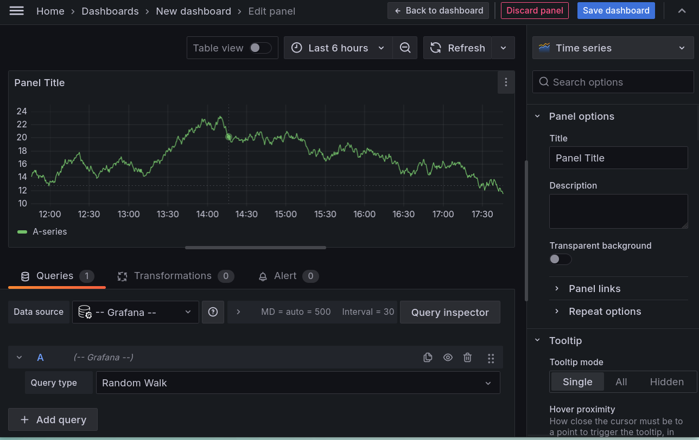

* Au centre, la visualisation
* En bas, les configurations des données
* À droite, les options de rendu.

ℹ️ Si vous n'avez pas de données affichées, il suffit de cliquer sur *Refresh*

### Les différents types de visualisation

On peut changer les types de représentation en sélectionnant le type de visualisation dans le menu déroulant disponible en cliquant sur *Time Series* en haut du bandeau de configuration des options de rendu.
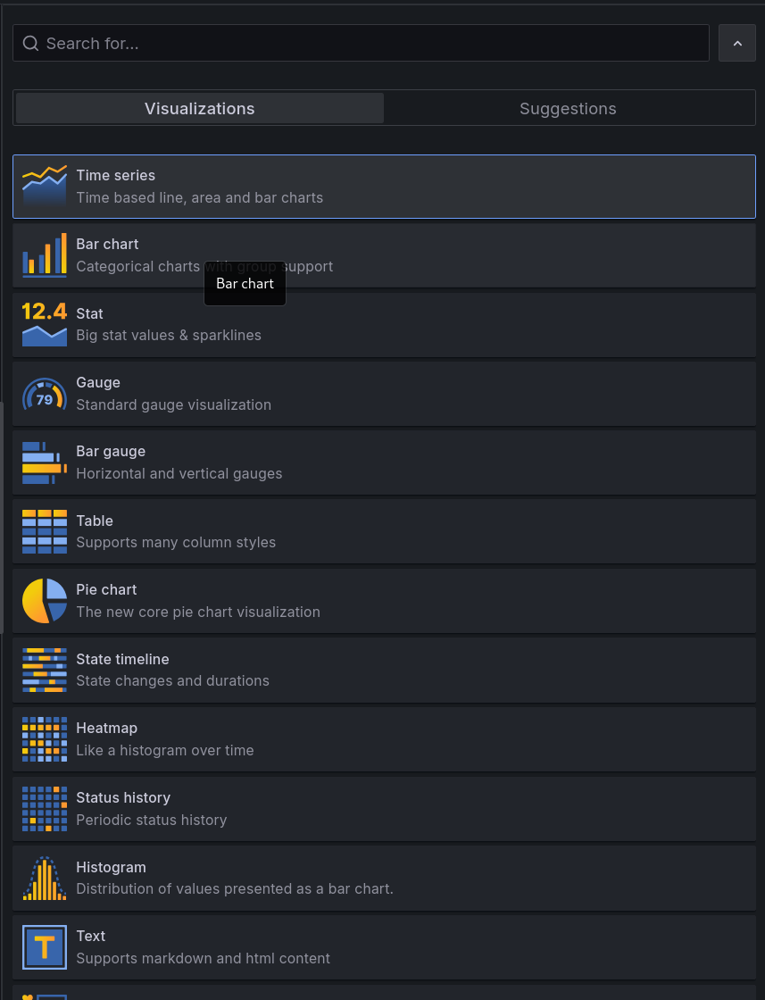

La partie Suggestion propose des visualisations en fonction des données que vous avez.
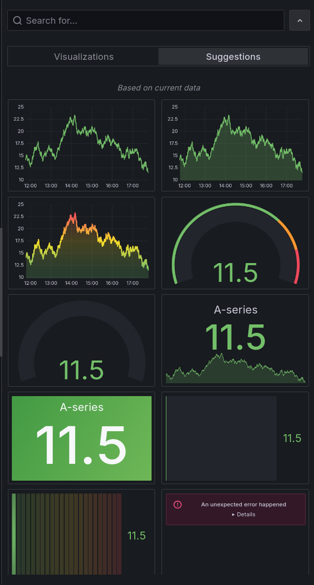

!!!success
    Cliquez sur plusieurs d'entre elles pour voir les modifications s'afficher en temps réel dans la visualisation.

### La zone de sélection temporelle

Une fois son modèle d'affichage sélectionné, on veut pouvoir choisir la période temporelle qui nous intéresse.

Grafana est prévu pour afficher des données temporelles, c'est-à-dire qu'il va prendre en compte nativement la date associée à chacune de vos données.

Il est alors possible de filtrer pour ne voir les données que sur une période donnée.

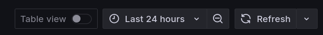

!!! note "Il est aussi possible de changer le range directement en sélectionnant la période souhaitée sur le graphique avec la souris."

    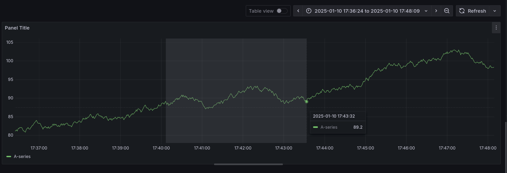

Le menu de sélection propose différentes plages de temps préconfigurées et il est aussi possible de définir une plage de temps personnalisée.
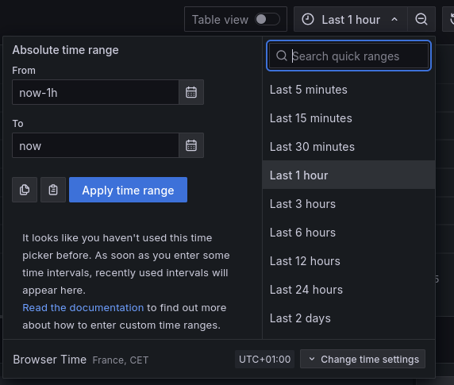

Par défaut, le rafraîchissement des données est automatique, mais vous pouvez définir une fréquence de rafraîchissement via le menu disponible via *Refresh*.

!!!success
    Faites le test en modifiant pour avoir un rafraîchissement toutes les 5secondes et voir le graphique se mettre à jour automatiquement.

## Inspection du widget

Il y a un menu de configuration sur chaque widget

Notamment la partie **Inspect** qui est bien pratique :

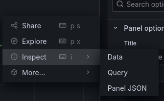

Via **Inspect**, vous pouvez voir:

* les données brutes
* la requête effectuée pour récupérer les données
* le JSON de configuration du panel de visualisation

Ce panel d'informations est aussi accessible via le bouton *Query Inspector* :

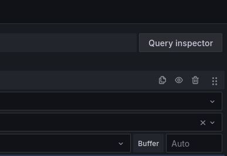

Elle permet de voir les données utilisées pour le widget, ainsi que la requête (variable, on y reviendra plus tard) qui a été faite pour les obtenir.

## Queries

En dessous de la visualisation, un onglet **Queries** est disponible.

Cela permet de configurer les requêtes qui seront utilisées pour récupérer les données à afficher.

!!!success "Changez la query pour avoir le paramétrage suivant"
    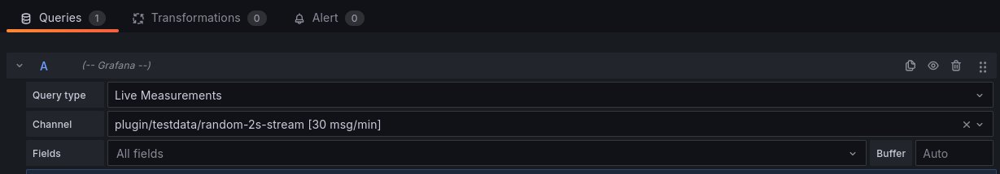

On a alors plusieurs séries de données qui s'affichent.

!!!info "Formulaire query"

    Dans les versions récentes de Grafana, on retrouve un mode *Builder* qui permet de construire la requête à l'aide d'un formulaire.
    
    On est guidé dans la construction de la requête. Le formulaire s'adapte à chaque type de requête (PromQL, SQL ...).
    C'est souvent pratique pour débuter et pour déboguer une requête.

    Le mode Code permet de voir la requête. C'est souvent plus rapide pour modifier une requête.

## Transformations

A coté de l'onglet **Queries**, il y a un onglet **Transformations**.

Les transformations permettent de modifier les données avant de les afficher.
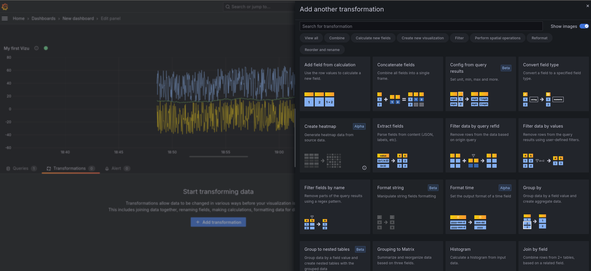

Il est possible de faire des [transformations](https://grafana.com/docs/grafana/latest/panels-visualizations/query-transform-data/transform-data/){target="_blank"} sur les données quelle que soit la source de données.

!!!info
    Ces transformations sont réalisées par Grafana, elles ne modifient pas les données dans la source de données.

C'est particulièrement utile pour les données qui ne sont pas prévues pour être facilement affichées. On peut alors extraire certaines informations, les convertir, les filtrer, les regrouper, etc.

!!!success
    Testez d'ajouter une transformation qui fait la somme de toutes les valeurs affichées.

## Les options communes à tous les widgets

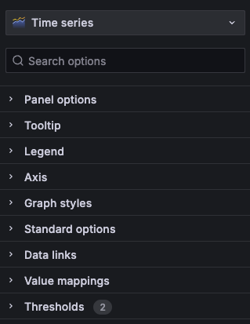

### Panel Options

* Le titre
* La description
* Les répétitions (on a un chapitre dédié 😉)

### Tooltip

Il est possible d'afficher les infos détaillées en passant la souris sur le graph.

!!!success
    Testez les différents modes pour voir la différence.

### Legend

Les légendes sont pratiques pour afficher rapidement les extrêmes / moyennes de vos données.

!!!success
    Configurer la légende pour obtenir le résultat suivant :
    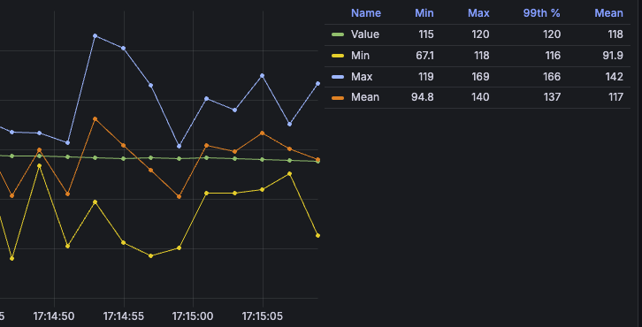

### Axis

Permet de régler les axes du graphique, les unités, les échelles, etc.

!!!success
    Passez votre graph en mode logarithmique par exemple.

### Graph Style

Ici, on retrouve les configurations spécifiques à chaque type de visualisation.

### Standard Options

Permettent de configurer les unités de grandeur.

On peut aussi choisir les couleurs d'affichage en fonction de la valeur des données (100°C en rouge par exemple et 0°C en bleu).

### Les Data Links

Ils permettent de faire des liens vers d'autres dashboards / visualizations / URL externes et peuvent utiliser des placeholders pour passer les valeurs courantes.

### Les Thresholds

Sans trop de surprise, ils permettent de définir des seuils et de leur associer une couleur particulière. Ils peuvent être définis de manière absolue ou relative (en %) et s'adapter aux valeurs affichées.

### (Advanced) Fields Override

Ils permettent de changer tout ou partie de la configuration du widget en fonction de la valeur des données.

## Sauvegarde du dashboard

On va enfin pouvoir sauvegarder notre dashboard.
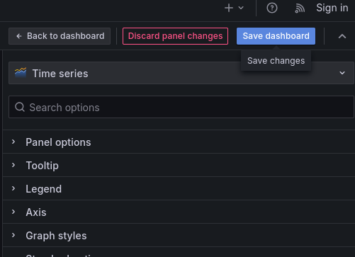

Ça y est, nous avons notre premier dashboard avec un seul widget. Nous allons maintenant pouvoir en ajouter d'autres.

**🛫 Prochaine étape : Configurer une sources de données SQL [➡️](../dashboard-business/README.md)**
